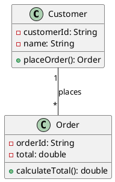
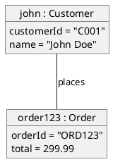
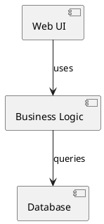
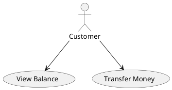
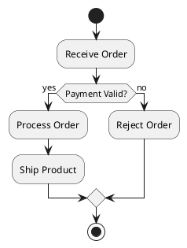
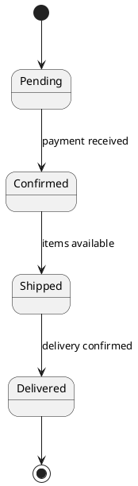
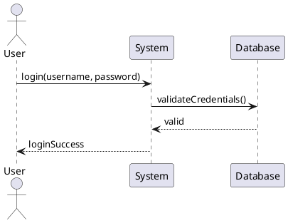

# Chapter 2: UML Diagrams Overview

UML 2.5 defines 14 different types of diagrams, each serving specific purposes in modeling software systems. Understanding when and how to use each diagram type is crucial for effective system modeling.

## Diagram Categories

UML diagrams are divided into two main categories:

### Structural Diagrams (7 types)
Show the static aspects of a system - what exists and how it's organized.

### Behavioral Diagrams (7 types)
Show the dynamic aspects of a system - what happens and how it changes over time.

---

## Structural Diagrams

### 1. Class Diagram
**Purpose**: Shows classes, their attributes, methods, and relationships.

**When to use**:
- System design and architecture
- Code generation
- Database design
- Understanding existing systems

**Key Elements**:
- Classes with attributes and methods
- Relationships (association, inheritance, etc.)
- Interfaces and abstract classes
- Multiplicity and visibility

**Example Use Case**: Designing the structure of an e-commerce system with Customer, Order, and Product classes.

### 2. Object Diagram
**Purpose**: Shows instances of classes at a specific point in time.

**When to use**:
- Illustrating examples of class relationships
- Debugging complex object structures
- Documenting test scenarios
- Showing system state snapshots

**Key Elements**:
- Object instances with actual values
- Links between objects
- Specific state at a moment in time

**Example Use Case**: Showing actual customer and order instances in a running system.

### 3. Component Diagram
**Purpose**: Shows how components are organized and their dependencies.

**When to use**:
- System architecture design
- Deployment planning
- Understanding component dependencies
- Modular system design

**Key Elements**:
- Components and their interfaces
- Dependencies between components
- Provided and required interfaces

**Example Use Case**: Showing how web application components interact.

### 4. Composite Structure Diagram
**Purpose**: Shows internal structure of classes and their collaborations.

**When to use**:
- Detailed class internal design
- Showing how parts collaborate
- Complex component relationships
- Pattern implementation details

### 5. Package Diagram
**Purpose**: Shows how packages are organized and their dependencies.

**When to use**:
- Large system organization
- Namespace management
- Dependency management
- Architectural layering

### 6. Deployment Diagram
**Purpose**: Shows hardware and software deployment configuration.

**When to use**:
- System deployment planning
- Infrastructure documentation
- Performance analysis
- Security planning

### 7. Profile Diagram
**Purpose**: Shows stereotypes and tagged values for domain-specific modeling.

**When to use**:
- Domain-specific languages
- Custom UML extensions
- Specialized modeling needs

---

## Behavioral Diagrams

### 1. Use Case Diagram
**Purpose**: Shows system functionality from user perspective.

**When to use**:
- Requirements gathering
- System scope definition
- Stakeholder communication
- Test planning

**Key Elements**:
- Actors (users and external systems)
- Use cases (system functionality)
- Relationships (include, extend, generalization)
- System boundary

**Example Use Case**: Banking system showing customer interactions.

### 2. Activity Diagram
**Purpose**: Shows workflow and business processes.

**When to use**:
- Business process modeling
- Algorithm design
- Workflow documentation
- Parallel process modeling

**Key Elements**:
- Activities and actions
- Decision points
- Parallel flows
- Start and end points

**Example Use Case**: Order processing workflow.

### 3. State Machine Diagram
**Purpose**: Shows how objects change state in response to events.

**When to use**:
- Object lifecycle modeling
- Protocol design
- User interface behavior
- System state management

**Key Elements**:
- States and transitions
- Events and guards
- Entry/exit actions
- Initial and final states

**Example Use Case**: Order state transitions.

### 4. Sequence Diagram
**Purpose**: Shows message exchanges between objects over time.

**When to use**:
- Interaction design
- API documentation
- Debugging scenarios
- Protocol specification

**Key Elements**:
- Lifelines (objects/actors)
- Messages between lifelines
- Activation boxes
- Time ordering

**Example Use Case**: Login process interaction.

### 5. Communication Diagram
**Purpose**: Shows message exchanges with emphasis on object relationships.

**When to use**:
- Alternative to sequence diagrams
- Emphasizing object structure
- Space-constrained documentation

### 6. Timing Diagram
**Purpose**: Shows timing constraints and state changes over time.

**When to use**:
- Real-time systems
- Performance requirements
- Protocol timing
- Hardware/software interaction

### 7. Interaction Overview Diagram
**Purpose**: Shows overview of interactions using activity diagram notation.

**When to use**:
- Complex interaction scenarios
- High-level interaction flow
- Multiple sequence combinations

---

## Choosing the Right Diagram

### By Development Phase

| Phase | Primary Diagrams | Secondary Diagrams |
|-------|------------------|-------------------|
| **Requirements** | Use Case, Activity | Sequence |
| **Analysis** | Class, Sequence | State Machine |
| **Design** | Class, Component | Sequence, State Machine |
| **Implementation** | Class, Component | Package |
| **Testing** | Sequence, Activity | Use Case |
| **Deployment** | Deployment, Component | Package |

### By Audience

| Audience | Recommended Diagrams |
|----------|---------------------|
| **Business Stakeholders** | Use Case, Activity |
| **System Analysts** | Use Case, Class, Sequence |
| **Architects** | Component, Deployment, Package |
| **Developers** | Class, Sequence, State Machine |
| **Testers** | Use Case, Sequence, Activity |
| **Operations** | Deployment, Component |

### By System Type

| System Type | Key Diagrams |
|-------------|--------------|
| **Web Applications** | Use Case, Class, Sequence, Deployment |
| **Real-time Systems** | State Machine, Timing, Sequence |
| **Business Systems** | Use Case, Activity, Class |
| **Embedded Systems** | State Machine, Timing, Component |
| **Distributed Systems** | Component, Deployment, Sequence |

---

## Diagram Relationships

Understanding how diagrams relate to each other helps create consistent models:

### Traceability Matrix

| From | To | Relationship |
|------|----|--------------|
| Use Case → | Sequence | Use cases realized by interactions |
| Use Case → | Activity | Use case steps as activities |
| Class → | Object | Classes instantiated as objects |
| Class → | Sequence | Classes participate in interactions |
| Component → | Deployment | Components deployed on nodes |
| State Machine → | Sequence | State changes triggered by messages |

### Consistency Rules

1. **Classes in sequence diagrams** must exist in class diagrams
2. **Use cases** should be traceable to sequence diagrams
3. **Components** should map to deployment nodes
4. **Object diagrams** must conform to class diagrams
5. **State machines** should align with class behavior

---

## Best Practices for Diagram Selection

### 1. Start with Purpose
- **What question are you trying to answer?**
- **Who is your audience?**
- **What level of detail is needed?**

### 2. Use Multiple Views
- No single diagram shows everything
- Combine diagrams for complete picture
- Maintain consistency across diagrams

### 3. Iterative Refinement
- Start with high-level diagrams
- Add detail progressively
- Validate with stakeholders

### 4. Tool Considerations
- Choose tools that support your diagram types
- Consider collaboration features
- Plan for maintenance and updates

---

## Common Anti-Patterns

### 1. Diagram Overload
❌ **Problem**: Creating too many diagrams
✅ **Solution**: Focus on diagrams that add value

### 2. Inconsistent Models
❌ **Problem**: Diagrams contradict each other
✅ **Solution**: Regular consistency checks

### 3. Wrong Abstraction Level
❌ **Problem**: Too much or too little detail
✅ **Solution**: Match detail to audience needs

### 4. Static Documentation
❌ **Problem**: Diagrams become outdated
✅ **Solution**: Integrate with development process

---

## Integration Strategies

### 1. Model-Driven Development
- Use diagrams to generate code
- Maintain models as primary artifacts
- Automate consistency checking

### 2. Documentation-Driven
- Use diagrams for communication
- Focus on key architectural decisions
- Update during major changes

### 3. Agile Integration
- Create diagrams just-in-time
- Focus on current iteration needs
- Use lightweight notation

---

**Next Chapter**: Continue to [Chapter 3: Class Diagrams](./03-class-diagrams.md) to dive deep into the most commonly used UML diagram type.

---

**Key Takeaways:**
- UML provides 14 diagram types for different modeling needs
- Choose diagrams based on purpose, audience, and system type
- Maintain consistency across related diagrams
- Use multiple diagrams for complete system understanding
- Start simple and add detail progressively 