# Chapter 3: Class Diagrams

Class diagrams are the most commonly used UML diagrams. They show the static structure of a system by displaying classes, their attributes, methods, and the relationships between them.

## What is a Class Diagram?

A **Class Diagram** is a structural diagram that shows:
- Classes in the system
- Attributes (properties) of each class
- Methods (operations) of each class
- Relationships between classes
- Visibility of attributes and methods

Class diagrams provide a blueprint for the system's structure and are often used for:
- System design and architecture
- Code generation
- Database design
- Documentation

---

## Class Notation

### Basic Class Structure

A class is represented as a rectangle divided into three compartments:

```
┌─────────────────────┐
│     ClassName       │  ← Class Name
├─────────────────────┤
│ - attribute1: Type  │  ← Attributes
│ + attribute2: Type  │
├─────────────────────┤
│ + method1(): Type   │  ← Methods
│ - method2(): void   │
└─────────────────────┘
```

### Visibility Modifiers

| Symbol | Visibility | Description |
|--------|------------|-------------|
| `+` | Public | Accessible from anywhere |
| `-` | Private | Accessible only within the class |
| `#` | Protected | Accessible within the class and subclasses |
| `~` | Package | Accessible within the same package |

### Attribute Syntax

```
visibility name : type [multiplicity] = defaultValue {property}
```

**Examples:**
- `- name: String`
- `+ age: int = 0`
- `# scores: int[*]`
- `~ status: boolean = true {readOnly}`

### Method Syntax

```
visibility name(parameters) : returnType {property}
```

**Examples:**
- `+ getName(): String`
- `- calculateAge(birthDate: Date): int`
- `# updateScore(score: int): void`
- `+ toString(): String {abstract}`

---

## Complete Class Example

**PlantUML Code:**
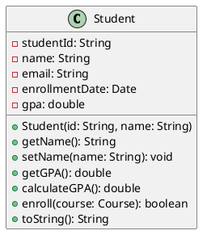

---

## Types of Classes

### 1. Concrete Classes
Regular classes that can be instantiated.

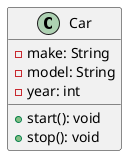

### 2. Abstract Classes
Classes that cannot be instantiated and may contain abstract methods.

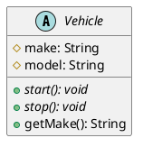

### 3. Interfaces
Contracts that define what methods a class must implement.

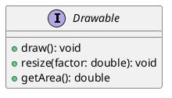

### 4. Enumerations
Special classes that represent a fixed set of constants.

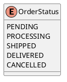

---

## Advanced Class Features

### 1. Static Members
Static attributes and methods belong to the class rather than instances.

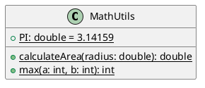

### 2. Properties and Stereotypes
Additional metadata about class elements.

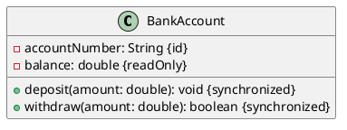

### 3. Template Classes (Generics)
Classes that work with generic types.

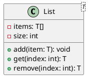

---

## Real-World Example: E-commerce System

Let's create a class diagram for an e-commerce system:

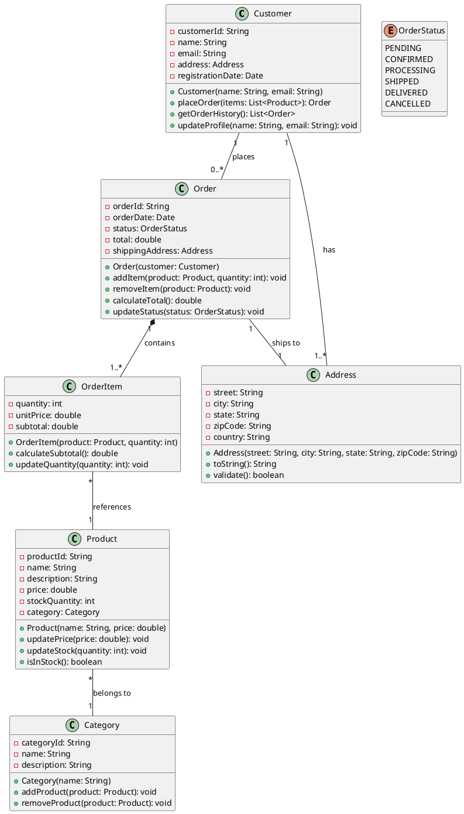

---

## Class Diagram Best Practices

### 1. Naming Conventions
- **Classes**: Use PascalCase (e.g., `CustomerOrder`)
- **Attributes**: Use camelCase (e.g., `firstName`)
- **Methods**: Use camelCase (e.g., `calculateTotal()`)
- **Constants**: Use UPPER_CASE (e.g., `MAX_ITEMS`)

### 2. Organization Tips
- Group related classes together
- Use packages to organize large systems
- Show only relevant attributes and methods
- Use consistent layout and spacing

### 3. Level of Detail
- **Conceptual**: Show main classes and relationships
- **Specification**: Include all attributes and method signatures
- **Implementation**: Include all details for code generation

### 4. Relationship Guidelines
- Show important relationships only
- Use appropriate relationship types
- Include multiplicity where relevant
- Add role names when helpful

---

## Common Class Diagram Patterns

### 1. Singleton Pattern
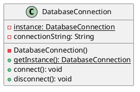

### 2. Factory Pattern
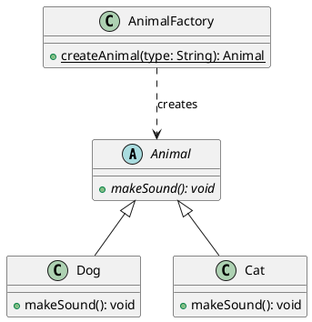

### 3. Observer Pattern
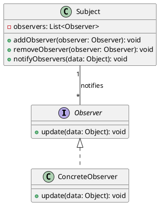

---

## Tools for Creating Class Diagrams

### 1. PlantUML (Text-based)
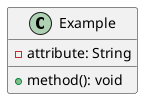

### 2. Draw.io (Visual)
- Drag and drop interface
- Web-based
- Free to use

### 3. Visual Paradigm (Professional)
- Code generation
- Reverse engineering
- Team collaboration

### 4. Lucidchart (Online)
- Collaborative editing
- Templates
- Integration with other tools

---

## Practice Exercises

### Exercise 1: Library Management System
Create a class diagram for a library system with:
- Books, Authors, Members, Librarians
- Borrowing and returning functionality
- Different types of books (Fiction, NonFiction, Reference)

### Exercise 2: Banking System
Design classes for:
- Different account types (Checking, Savings, Credit)
- Customers and their accounts
- Transactions (Deposit, Withdrawal, Transfer)
- ATM operations

### Exercise 3: Social Media Platform
Model a simple social media system with:
- Users and their profiles
- Posts, Comments, and Likes
- Friend relationships
- Different types of content (Text, Image, Video)

---

## Common Mistakes to Avoid

1. **Too Much Detail**: Don't include every attribute and method
2. **Wrong Relationships**: Choose appropriate relationship types
3. **Missing Multiplicity**: Always specify cardinality
4. **Inconsistent Naming**: Use consistent naming conventions
5. **Cluttered Layout**: Keep diagrams clean and readable
6. **No Packages**: Use packages for large systems
7. **Ignoring Visibility**: Specify appropriate visibility modifiers

---

## Integration with Code

### From Code to Diagram (Reverse Engineering)
Many tools can generate class diagrams from existing code:

```java
public class Student {
    private String studentId;
    private String name;
    private List<Course> courses;
    
    public Student(String id, String name) {
        this.studentId = id;
        this.name = name;
        this.courses = new ArrayList<>();
    }
    
    public void enrollInCourse(Course course) {
        courses.add(course);
    }
}
```

### From Diagram to Code (Forward Engineering)
Class diagrams can be used to generate code skeletons:

```python
class Student:
    def __init__(self, student_id: str, name: str):
        self._student_id = student_id
        self._name = name
        self._courses = []
    
    def enroll_in_course(self, course):
        self._courses.append(course)
```

---

**Next Chapter**: Continue to [Chapter 4: Relationships in UML](./04-relationships.md) to learn about the different types of relationships between classes.

---

**Key Takeaways:**
- Class diagrams show the static structure of a system
- Use appropriate visibility modifiers and naming conventions
- Include relevant attributes, methods, and relationships
- Choose the right level of detail for your audience
- Use tools that support your workflow (text-based vs. visual)
- Keep diagrams clean, organized, and focused 