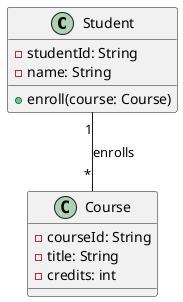
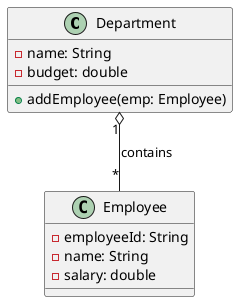
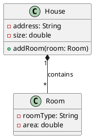
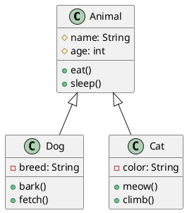
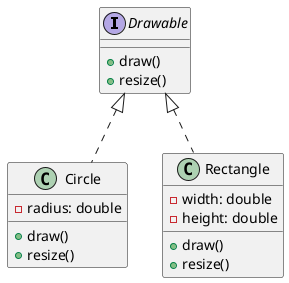
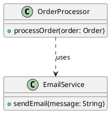
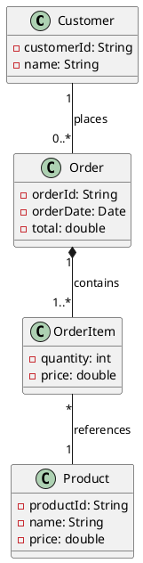
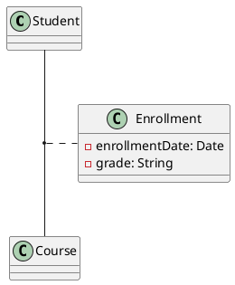
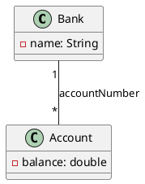
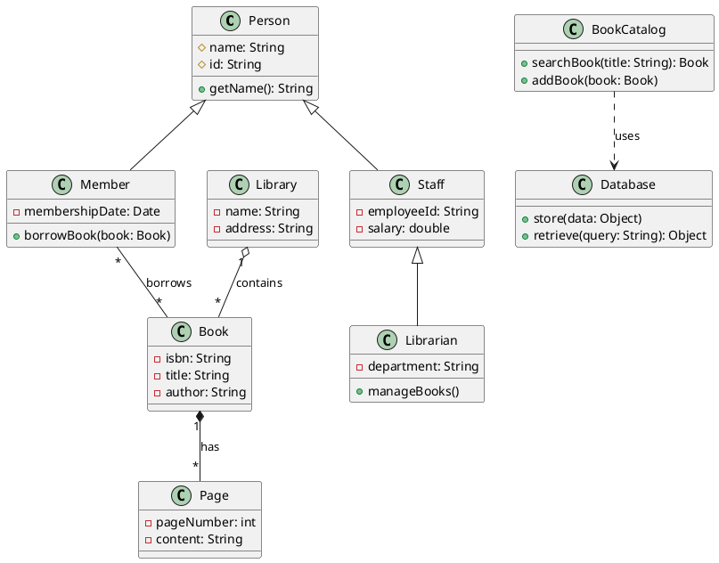

# Chapter 4: Relationships in UML

Relationships are the backbone of UML diagrams. They show how different elements interact, depend on each other, or are related. Understanding relationships is crucial for creating meaningful UML diagrams.

## Types of Relationships

UML defines several types of relationships, each with specific meanings and notations:

1. **Association**
2. **Aggregation**
3. **Composition**
4. **Inheritance (Generalization)**
5. **Realization**
6. **Dependency**

---

## 1. Association

**Definition**: Association represents a structural relationship between classes where objects of one class are connected to objects of another class.

### Characteristics:
- Represents a "uses" or "has" relationship
- Both classes can exist independently
- Can be bidirectional or unidirectional
- Can have multiplicity

### Notation:
- Solid line connecting two classes
- Arrow indicates direction (optional)
- Multiplicity at both ends

### Example:

```
Student ────────── Course
   1      enrolls     *
```

**PlantUML Code:**


### Real-world Examples:
- **Person** drives **Car**
- **Customer** places **Order**
- **Teacher** teaches **Subject**

---

## 2. Aggregation

**Definition**: Aggregation is a special form of association that represents a "whole-part" relationship where the part can exist without the whole.

### Characteristics:
- Represents "has-a" relationship
- Weak ownership
- Parts can exist independently of the whole
- Parts can be shared between wholes

### Notation:
- Line with an empty diamond at the "whole" end
- Diamond points to the container/whole

### Example:

```
Department ◇────── Employee
     1              *
```

**PlantUML Code:**


### Real-world Examples:
- **University** has **Students** (students can transfer)
- **Team** has **Players** (players can change teams)
- **Library** has **Books** (books can be moved to other libraries)

---

## 3. Composition

**Definition**: Composition is a strong form of aggregation where the part cannot exist without the whole. It represents a "part-of" relationship with strong ownership.

### Characteristics:
- Represents strong "has-a" relationship
- Strong ownership
- Parts cannot exist without the whole
- When whole is destroyed, parts are also destroyed
- Parts cannot be shared

### Notation:
- Line with a filled diamond at the "whole" end
- Diamond points to the container/whole

### Example:

```
House ◆────── Room
  1             *
```

**PlantUML Code:**


### Real-world Examples:
- **Car** has **Engine** (engine is part of the car)
- **Book** has **Pages** (pages belong to the book)
- **Computer** has **CPU** (CPU is integral to computer)

---

## 4. Inheritance (Generalization)

**Definition**: Inheritance represents an "is-a" relationship where a subclass inherits properties and methods from a superclass.

### Characteristics:
- Represents "is-a" relationship
- Subclass inherits all attributes and methods
- Supports polymorphism
- Enables code reuse

### Notation:
- Line with an empty triangle pointing to the superclass
- Triangle points to the parent/superclass

### Example:

```
    Animal
      △
      │
   ───┴───
   │     │
  Dog   Cat
```

**PlantUML Code:**


### Real-world Examples:
- **Vehicle** ← **Car**, **Truck**, **Motorcycle**
- **Shape** ← **Circle**, **Rectangle**, **Triangle**
- **Employee** ← **Manager**, **Developer**, **Designer**

---

## 5. Realization

**Definition**: Realization represents a relationship between a specification (interface) and its implementation (class).

### Characteristics:
- Represents "implements" relationship
- Class provides concrete implementation of interface
- Interface defines contract

### Notation:
- Dashed line with empty triangle pointing to interface
- Triangle points to the interface

### Example:

```
<<interface>>
   Drawable
      △
      ┊
   ───┴───
   ┊     ┊
Circle  Rectangle
```

**PlantUML Code:**


---

## 6. Dependency

**Definition**: Dependency represents a "uses" relationship where one class depends on another class.

### Characteristics:
- Represents temporary relationship
- One class uses another class
- Weakest form of relationship
- Often represents method parameters or local variables

### Notation:
- Dashed line with arrow pointing to the used class

### Example:

```
OrderProcessor ┄┄┄> EmailService
              uses
```

**PlantUML Code:**


---

## Relationship Comparison Table

| Relationship | Strength | Notation | Meaning | Example |
|-------------|----------|----------|---------|---------|
| **Dependency** | Weakest | `┄┄┄>` | Uses | Class A uses Class B |
| **Association** | Weak | `────` | Has/Uses | Student enrolls in Course |
| **Aggregation** | Medium | `◇───` | Has (weak ownership) | Department has Employees |
| **Composition** | Strong | `◆───` | Part of (strong ownership) | House has Rooms |
| **Inheritance** | Strongest | `───△` | Is a | Dog is an Animal |
| **Realization** | Implementation | `┄┄△` | Implements | Circle implements Drawable |

---

## Multiplicity in Relationships

Multiplicity specifies how many instances of one class can be associated with instances of another class.

### Common Multiplicity Values:

| Notation | Meaning |
|----------|---------|
| `1` | Exactly one |
| `0..1` | Zero or one |
| `*` or `0..*` | Zero or more |
| `1..*` | One or more |
| `2..5` | Between 2 and 5 |
| `n` | Exactly n |

### Example with Multiplicity:



---

## Advanced Relationship Concepts

### 1. Role Names
You can specify role names to clarify the relationship:

```
Employee ────── Company
manager    works for   employer
```

### 2. Association Classes
When an association itself has attributes:



### 3. Qualified Associations
When you need to specify how to navigate the association:



---

## Best Practices for Relationships

1. **Choose the Right Relationship**: Use the most appropriate relationship type
2. **Specify Multiplicity**: Always include multiplicity when relevant
3. **Use Role Names**: Add role names when relationships aren't obvious
4. **Avoid Over-modeling**: Don't show every possible relationship
5. **Be Consistent**: Use consistent notation throughout your diagrams
6. **Consider Lifecycle**: Think about object lifecycles when choosing composition vs aggregation

---

## Common Mistakes to Avoid

1. **Confusing Aggregation and Composition**: Remember the lifecycle dependency
2. **Overusing Inheritance**: Prefer composition over inheritance when appropriate
3. **Missing Multiplicity**: Always specify multiplicity for associations
4. **Wrong Arrow Direction**: Ensure arrows point in the correct direction
5. **Too Many Relationships**: Keep diagrams focused and readable

---

## Practice Exercise

Create a UML class diagram for a library system with the following requirements:

1. A **Library** has many **Books**
2. A **Book** has **Pages** (pages cannot exist without the book)
3. **Members** can borrow **Books**
4. **Staff** and **Members** are both types of **Person**
5. **Librarian** is a type of **Staff**
6. **BookCatalog** uses **Database** to store information

**Solution:**



---

**Next Chapter**: Continue to [Chapter 5: Use Case Diagrams](./05-use-case-diagrams.md) to learn about modeling system functionality from a user's perspective.

---

**Key Takeaways:**
- **Association**: General relationship between classes
- **Aggregation**: Weak "has-a" relationship (parts can exist independently)
- **Composition**: Strong "has-a" relationship (parts cannot exist without whole)
- **Inheritance**: "Is-a" relationship with property and method inheritance
- **Realization**: Implementation of interfaces
- **Dependency**: Temporary "uses" relationship
- Always specify multiplicity and consider object lifecycles 