# Chapter 5: Use Case Diagrams

Use case diagrams are behavioral diagrams that show the functionality of a system from a user's perspective. They capture the requirements of a system by showing how users (actors) interact with the system to achieve specific goals.

## What is a Use Case Diagram?

A **Use Case Diagram** shows:
- **Actors**: Users or external systems that interact with the system
- **Use Cases**: Specific functionality or services the system provides
- **Relationships**: How actors and use cases are connected
- **System Boundary**: What is inside and outside the system

Use case diagrams are primarily used for:
- Requirements gathering and analysis
- System scope definition
- Communication with stakeholders
- Test case planning
- Project planning and estimation

---

## Basic Elements

### 1. Actors

**Definition**: An actor represents a role played by a user or external system that interacts with the system.

**Notation**: Stick figure with a name below

**Types of Actors**:
- **Primary Actors**: Initiate use cases to achieve goals
- **Secondary Actors**: Provide services to the system
- **External Systems**: Other systems that interact with our system

**Examples**:
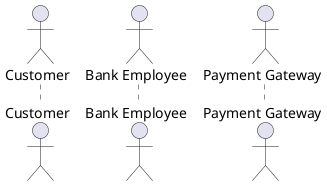

### 2. Use Cases

**Definition**: A use case represents a specific piece of functionality that the system provides to achieve a user goal.

**Notation**: Oval with the use case name inside

**Characteristics**:
- Describes what the system does, not how
- Represents a complete interaction
- Provides value to an actor
- Has a clear beginning and end

**Examples**:
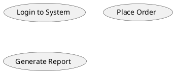

### 3. System Boundary

**Definition**: A rectangle that defines what is inside the system (use cases) and what is outside (actors).

**Notation**: Rectangle with system name at the top

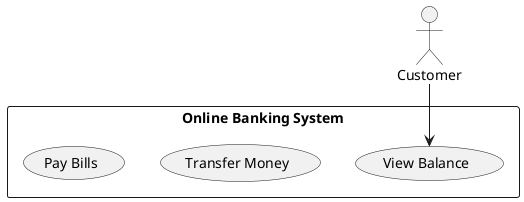

---

## Relationships in Use Case Diagrams

### 1. Association

**Definition**: Shows that an actor participates in a use case.

**Notation**: Solid line connecting actor to use case

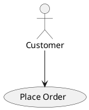

### 2. Include Relationship

**Definition**: A use case includes another use case as part of its normal flow.

**Notation**: Dashed arrow with `<<include>>` stereotype

**When to use**: When multiple use cases share common functionality

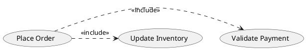

### 3. Extend Relationship

**Definition**: A use case extends another use case with additional behavior under certain conditions.

**Notation**: Dashed arrow with `<<extend>>` stereotype

**When to use**: For optional or exceptional behavior

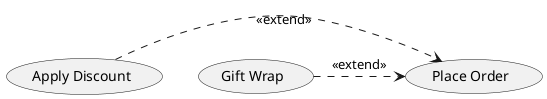

### 4. Generalization

**Definition**: Shows that one use case is a specialized version of another.

**Notation**: Solid arrow with triangle pointing to the general use case

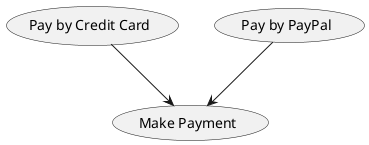

---

## Complete Example: Online Banking System

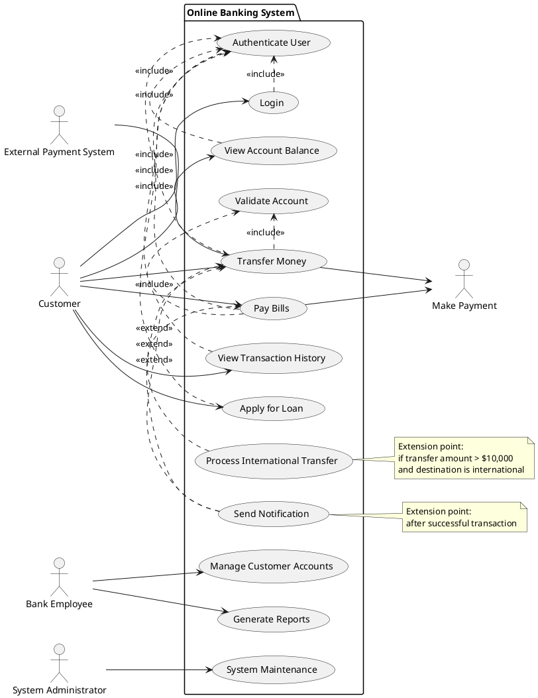

---

## Real-World Examples

### Example 1: E-Learning Platform

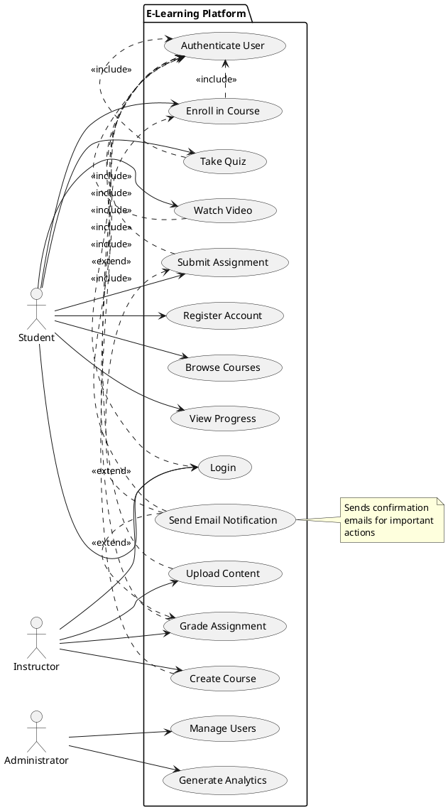

### Example 2: Hospital Management System

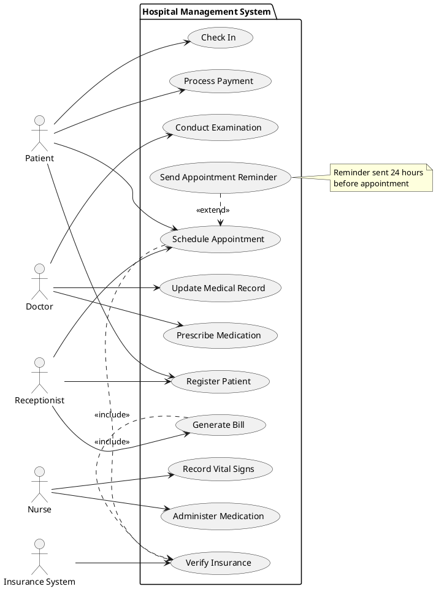

---

## Best Practices

### 1. Naming Conventions

**Use Cases**:
- Start with a verb (action)
- Use active voice
- Be specific and clear
- Examples: "Place Order", "Generate Report", "Update Profile"

**Actors**:
- Use nouns representing roles
- Be specific about the role
- Examples: "Customer", "System Administrator", "Payment Gateway"

### 2. Scope and Level

**System Level**: Focus on what the system does for users
- ✅ "Process Order"
- ❌ "Validate Credit Card Number" (too detailed)

**User Goal Level**: Each use case should achieve a user goal
- ✅ "Book Flight"
- ❌ "Click Submit Button" (too low level)

### 3. Actor Guidelines

**Primary vs Secondary Actors**:
- Primary actors initiate use cases
- Secondary actors are called upon by the system

**External Systems as Actors**:
- Treat external systems as actors when they interact with your system
- Examples: Payment Gateway, Email Service, Database

### 4. Relationship Guidelines

**Include Relationships**:
- Use when functionality is always performed
- Common functionality shared by multiple use cases
- Example: Authentication is always required

**Extend Relationships**:
- Use for optional or conditional behavior
- Exceptional flows
- Example: Apply discount (only if customer has coupon)

**Avoid Overuse**:
- Don't create complex hierarchies
- Keep diagrams simple and readable
- Focus on main functionality

---

## Common Mistakes to Avoid

### 1. Functional Decomposition
❌ **Wrong**: Breaking down use cases into implementation steps
```
- "Validate Input"
- "Check Database"
- "Update Record"
- "Send Response"
```

✅ **Correct**: Focus on user goals
```
- "Update Customer Profile"
```

### 2. Too Many Relationships
❌ **Wrong**: Overusing include/extend relationships
✅ **Correct**: Use relationships sparingly and only when necessary

### 3. Implementation Details
❌ **Wrong**: "Save to Database", "Call Web Service"
✅ **Correct**: "Store Customer Information", "Process Payment"

### 4. Missing Actors
❌ **Wrong**: Not identifying all actors who interact with the system
✅ **Correct**: Include all primary and secondary actors

### 5. Vague Use Case Names
❌ **Wrong**: "Manage Data", "Handle Request"
✅ **Correct**: "Update Product Catalog", "Process Refund Request"

---

## Use Case Documentation

While use case diagrams show the overview, each use case should be documented with:

### Basic Template

**Use Case**: Place Order
**Actor**: Customer
**Precondition**: Customer is logged in and has items in cart
**Postcondition**: Order is placed and confirmation is sent

**Main Flow**:
1. Customer selects "Checkout"
2. System displays order summary
3. Customer confirms shipping address
4. Customer selects payment method
5. System processes payment
6. System creates order record
7. System sends confirmation email

**Alternative Flows**:
- 5a. Payment fails: System displays error message
- 3a. Customer changes address: System updates shipping cost

**Exception Flows**:
- System unavailable: Display maintenance message

---

## Tools for Creating Use Case Diagrams

### 1. PlantUML (Text-based)
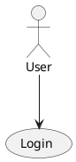

### 2. Draw.io (Visual)
- Free online tool
- Drag and drop interface
- Good for quick diagrams

### 3. Lucidchart (Professional)
- Collaborative editing
- Templates available
- Integration with other tools

### 4. Visual Paradigm (Enterprise)
- Full UML support
- Requirements management
- Code generation capabilities

---

## Integration with Development Process

### 1. Requirements Gathering
- Use case diagrams help identify system scope
- Facilitate discussions with stakeholders
- Ensure all user needs are captured

### 2. Test Planning
- Each use case becomes a test scenario
- Alternative flows become test cases
- Exception flows become error test cases

### 3. Project Planning
- Use cases help estimate development effort
- Prioritize features based on actor importance
- Plan iterations around use case completion

### 4. System Design
- Use cases drive system architecture
- Identify major system components
- Define interfaces between components

---

**Next Chapter**: Continue to [Chapter 6: Sequence Diagrams](./06-sequence-diagrams.md) to learn about modeling interactions over time.

---

**Key Takeaways:**
- Use case diagrams capture system functionality from user perspective
- Focus on what the system does, not how it does it
- Actors represent roles, not specific individuals
- Use relationships (include, extend, generalization) sparingly
- Keep diagrams simple and focused on main functionality
- Document detailed use case flows separately from diagrams 