# Chapter 6: Sequence Diagrams

Sequence diagrams are behavioral diagrams that show how objects interact with each other over time. They capture the dynamic behavior of a system by showing the sequence of messages exchanged between objects to accomplish a specific task.

## What is a Sequence Diagram?

A **Sequence Diagram** shows:
- **Lifelines**: Objects or actors participating in the interaction
- **Messages**: Communications between lifelines
- **Time Ordering**: The sequence in which messages are sent
- **Activation Boxes**: When objects are active/processing
- **Control Flow**: How the interaction progresses

Sequence diagrams are primarily used for:
- Interaction design and documentation
- API specification
- Debugging and troubleshooting
- Understanding system behavior
- Test case design

---

## Basic Elements

### 1. Lifelines

**Definition**: Vertical dashed lines representing objects or actors that participate in the interaction.

**Notation**: Rectangle at the top with name, connected to a vertical dashed line

**Syntax**: `objectName : ClassName` or just `objectName`

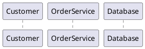

### 2. Messages

**Definition**: Horizontal arrows showing communication between lifelines.

**Types of Messages**:
- **Synchronous**: Solid arrow (→) - sender waits for response
- **Asynchronous**: Open arrow (-->) - sender doesn't wait
- **Return**: Dashed arrow (←--) - response message
- **Self Message**: Arrow to same lifeline

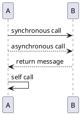

### 3. Activation Boxes

**Definition**: Rectangles on lifelines showing when an object is active/processing.

**Notation**: Thin rectangles overlaying the lifeline

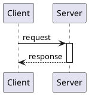

### 4. Combined Fragments

**Definition**: Frames that group messages and add control logic.

**Types**:
- **alt**: Alternative (if-else)
- **opt**: Optional
- **loop**: Iteration
- **par**: Parallel
- **ref**: Reference to another diagram

---

## Message Types and Notation

### 1. Synchronous Messages
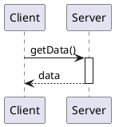

### 2. Asynchronous Messages
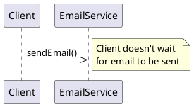

### 3. Create and Destroy Messages
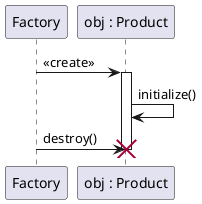

### 4. Found and Lost Messages
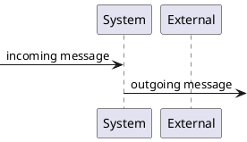

---

## Combined Fragments

### 1. Alternative (alt)
Shows conditional logic - if/else scenarios.

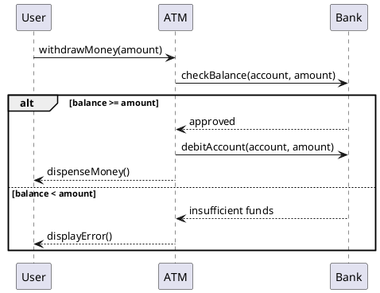

### 2. Optional (opt)
Shows optional behavior that may or may not occur.

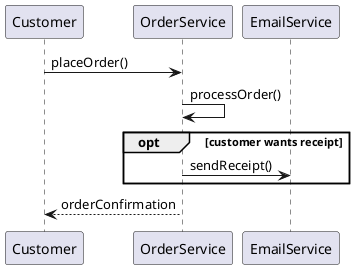

### 3. Loop
Shows repetitive behavior.

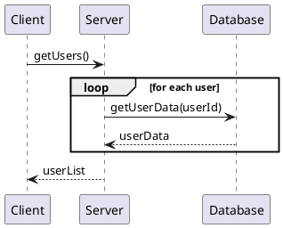

### 4. Parallel (par)
Shows concurrent execution.

```plantuml
@startuml
participant OrderService
participant InventoryService
participant PaymentService
participant EmailService

OrderService -> OrderService: processOrder()

par
    OrderService -> InventoryService: reserveItems()
and
    OrderService -> PaymentService: processPayment()
and
    OrderService -> EmailService: sendConfirmation()
end
@enduml
```

---

## Complete Example: Online Shopping

```plantuml
@startuml
title Online Shopping - Order Processing

actor Customer
participant "Web UI" as UI
participant "OrderService" as OS
participant "InventoryService" as IS
participant "PaymentService" as PS
participant "EmailService" as ES
participant "Database" as DB

Customer -> UI: selectItems()
Customer -> UI: checkout()

UI -> OS: createOrder(items, customer)
activate OS

OS -> IS: checkAvailability(items)
activate IS
IS -> DB: queryStock(items)
activate DB
DB --> IS: stockLevels
deactivate DB
IS --> OS: availabilityResult
deactivate IS

alt all items available
    OS -> PS: processPayment(amount, paymentInfo)
    activate PS
    
    alt payment successful
        PS -> DB: recordTransaction()
        activate DB
        DB --> PS: transactionId
        deactivate DB
        PS --> OS: paymentConfirmed(transactionId)
        deactivate PS
        
        OS -> IS: reserveItems(items)
        activate IS
        IS -> DB: updateInventory(items)
        activate DB
        DB --> IS: updated
        deactivate DB
        IS --> OS: itemsReserved
        deactivate IS
        
        OS -> DB: saveOrder(orderDetails)
        activate DB
        DB --> OS: orderId
        deactivate DB
        
        par
            OS -> ES: sendOrderConfirmation(customer, orderId)
        and
            OS -> ES: sendReceiptEmail(customer, orderDetails)
        end
        
        OS --> UI: orderSuccess(orderId)
        
    else payment failed
        PS --> OS: paymentFailed(reason)
        deactivate PS
        OS --> UI: paymentError(reason)
    end
    
else items not available
    OS --> UI: itemsUnavailable(unavailableItems)
end

deactivate OS
UI --> Customer: displayResult()

note right of Customer : Customer receives\nconfirmation email\nand receipt
@enduml
```

---

## Advanced Features

### 1. Reference Fragments
Reference other sequence diagrams to avoid repetition.

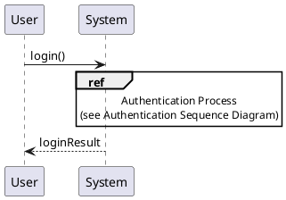

### 2. Interaction Operators

| Operator | Description | Usage |
|----------|-------------|-------|
| `alt` | Alternative | if-else logic |
| `opt` | Optional | optional behavior |
| `loop` | Loop | repetitive behavior |
| `par` | Parallel | concurrent execution |
| `seq` | Sequence | default sequential |
| `strict` | Strict | strict ordering |
| `neg` | Negative | invalid scenarios |
| `critical` | Critical | atomic operation |
| `ignore` | Ignore | ignored messages |
| `consider` | Consider | considered messages |
| `assert` | Assert | mandatory behavior |

### 3. Guards and Conditions
Add conditions to messages and fragments.

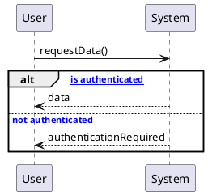

### 4. Time Constraints
Show timing requirements.

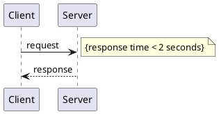

---

## Real-World Examples

### Example 1: User Authentication

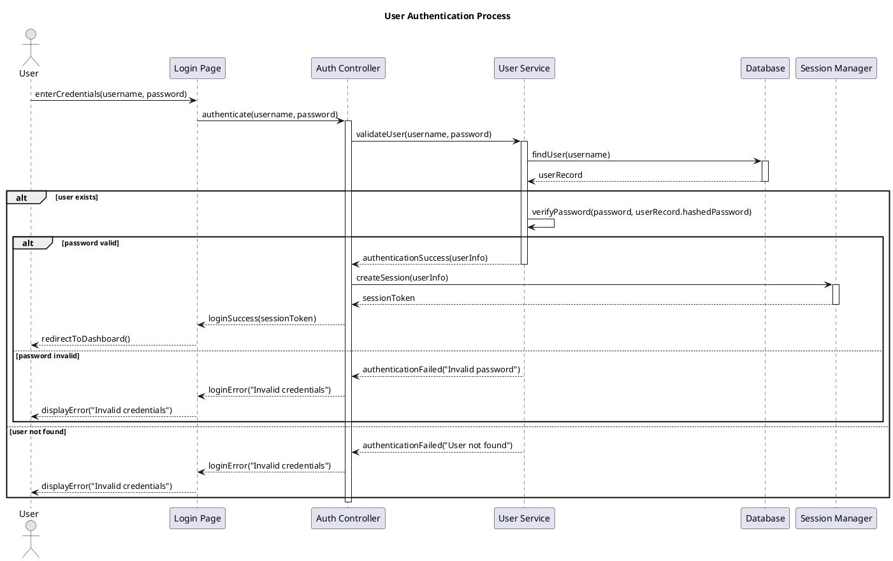

### Example 2: API Request Processing

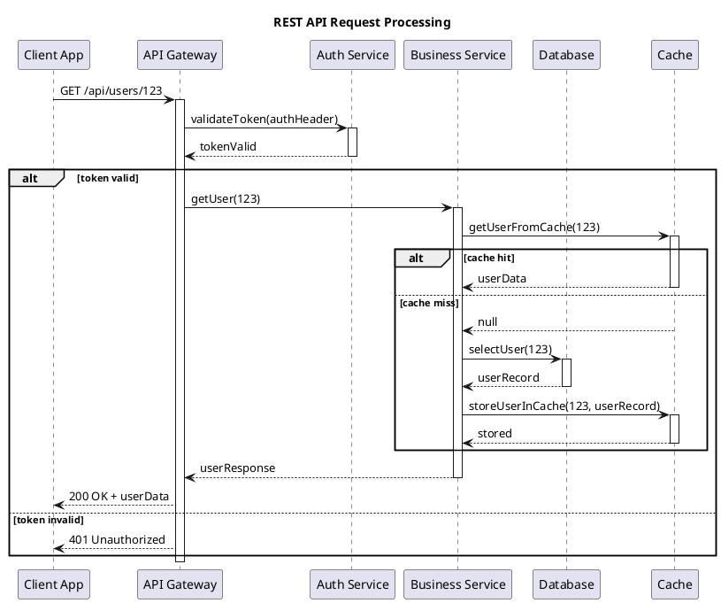

---

## Best Practices

### 1. Naming Conventions
- **Lifelines**: Use clear, descriptive names
- **Messages**: Use verb phrases describing the action
- **Parameters**: Include relevant parameters in message names

### 2. Level of Detail
- **High-level**: Focus on main flow, omit implementation details
- **Detailed**: Include all messages and parameters for implementation
- **Match audience**: Business stakeholders vs. developers

### 3. Layout and Organization
- **Left to right**: Arrange lifelines logically (user → system → database)
- **Group related**: Keep related lifelines close together
- **Minimize crossings**: Avoid crossing message lines when possible

### 4. Fragment Usage
- **Use sparingly**: Don't overuse combined fragments
- **Clear conditions**: Make guard conditions explicit and understandable
- **Proper nesting**: Avoid deeply nested fragments

### 5. Error Handling
- **Show alternatives**: Include error scenarios in alt fragments
- **Exception flows**: Document what happens when things go wrong
- **Recovery actions**: Show how the system recovers from errors

---

## Common Mistakes to Avoid

### 1. Too Much Detail
❌ **Wrong**: Showing every getter/setter call
✅ **Correct**: Focus on significant interactions

### 2. Missing Activations
❌ **Wrong**: Not showing when objects are active
✅ **Correct**: Use activation boxes to show processing time

### 3. Unclear Message Names
❌ **Wrong**: `doSomething()`, `process()`
✅ **Correct**: `validatePayment()`, `updateInventory()`

### 4. Inconsistent Abstraction
❌ **Wrong**: Mixing high-level and low-level details
✅ **Correct**: Maintain consistent level of abstraction

### 5. Complex Fragments
❌ **Wrong**: Deeply nested alt/loop combinations
✅ **Correct**: Break complex scenarios into multiple diagrams

---

## Tools and Techniques

### 1. PlantUML Sequence Diagrams
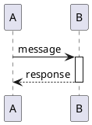

### 2. Sequence Diagram Generation
- **From code**: Tools can generate diagrams from execution traces
- **From logs**: Analyze system logs to create interaction diagrams
- **From tests**: Use test scenarios to drive diagram creation

### 3. Interactive Diagrams
- **Clickable elements**: Link to detailed specifications
- **Expandable sections**: Show/hide detail levels
- **Animation**: Show message flow over time

---

## Integration with Development

### 1. Requirements to Design
- Use case scenarios → sequence diagrams
- User stories → interaction flows
- Business processes → system interactions

### 2. Design to Implementation
- Sequence diagrams → API specifications
- Message flows → method signatures
- Object interactions → class collaborations

### 3. Testing and Validation
- Sequence diagrams → test scenarios
- Message flows → integration tests
- Error paths → exception testing

---

**Next Chapter**: Continue to [Chapter 7: Activity Diagrams](./07-activity-diagrams.md) to learn about modeling workflows and business processes.

---

**Key Takeaways:**
- Sequence diagrams show object interactions over time
- Use lifelines, messages, and activation boxes effectively
- Combined fragments add control logic (alt, opt, loop, par)
- Focus on significant interactions, not implementation details
- Include error scenarios and alternative flows
- Match level of detail to your audience and purpose 