# Chapter 7: Activity Diagrams

Activity diagrams are behavioral diagrams that show the flow of activities and actions within a system. They model workflows, business processes, and algorithms by showing the sequence of activities and the decisions that control the flow.

## What is an Activity Diagram?

An **Activity Diagram** shows:
- **Activities**: Tasks or operations being performed
- **Control Flow**: The order in which activities are executed
- **Decision Points**: Where the flow branches based on conditions
- **Parallel Activities**: Activities that can occur simultaneously
- **Start and End Points**: Where the process begins and ends

Activity diagrams are primarily used for:
- Business process modeling
- Workflow documentation
- Algorithm design
- Use case realization
- System behavior analysis

---

## Basic Elements

### 1. Activities and Actions

**Activity**: A larger unit of work that may contain other activities
**Action**: An atomic unit of work that cannot be decomposed

**Notation**: Rounded rectangles

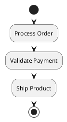

### 2. Control Flow

**Definition**: Arrows showing the sequence of activities

**Notation**: Solid arrows connecting activities

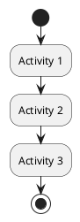

### 3. Initial and Final Nodes

**Initial Node**: Black filled circle - where the activity starts
**Final Node**: Black filled circle with border - where the activity ends
**Flow Final**: Circle with X - ends a specific flow

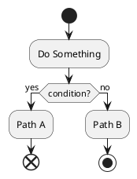

### 4. Decision and Merge Nodes

**Decision Node**: Diamond shape - where flow branches based on conditions
**Merge Node**: Diamond shape - where flows come back together

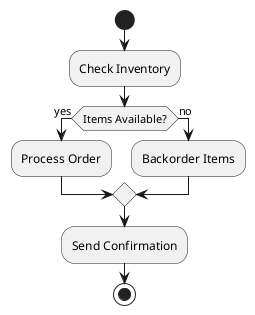

---

## Advanced Control Structures

### 1. Fork and Join (Parallel Activities)

**Fork**: Splits flow into parallel paths
**Join**: Synchronizes parallel paths back together

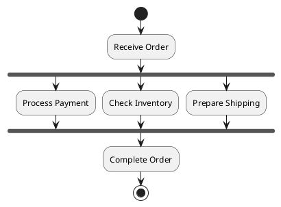

### 2. Loops and Iteration

**While Loop**: Repeat while condition is true
**For Loop**: Repeat for a specific number of times

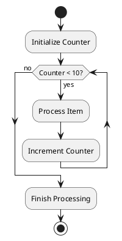

### 3. Exception Handling

Show how exceptions are handled in the flow.

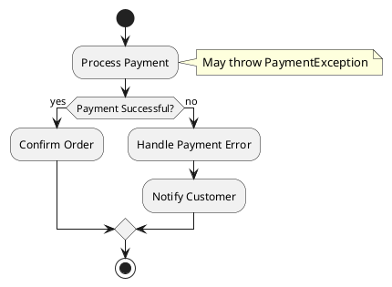

---

## Swimlanes (Activity Partitions)

Swimlanes organize activities by responsibility - showing who or what performs each activity.

### Vertical Swimlanes

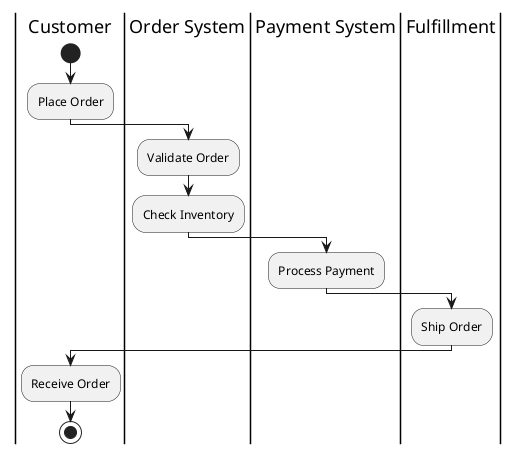

### Horizontal Swimlanes

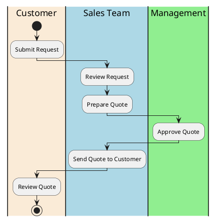

---

## Complete Example: Order Processing Workflow

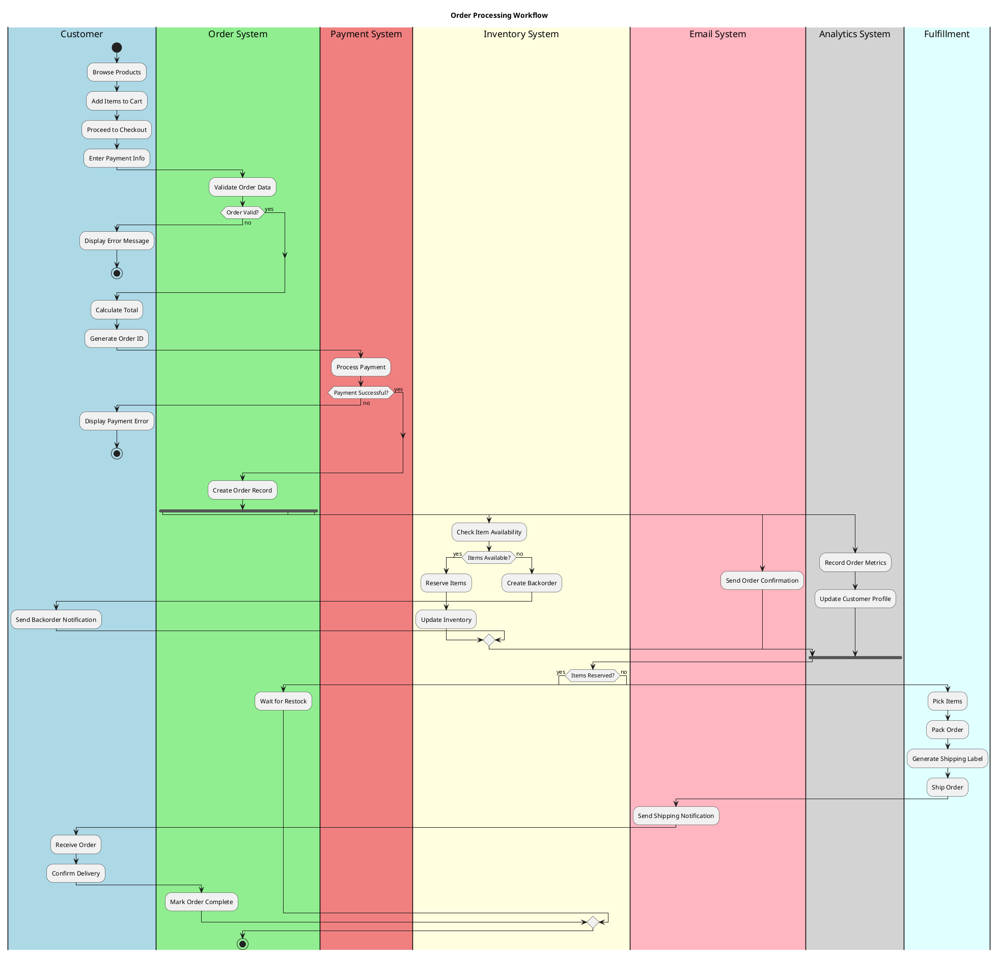

---

## Real-World Examples

### Example 1: Software Development Process

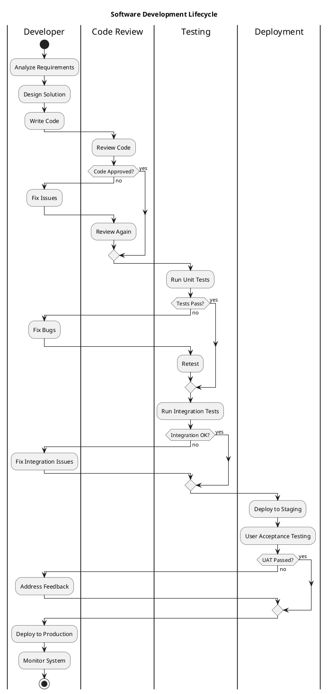

### Example 2: Customer Support Process

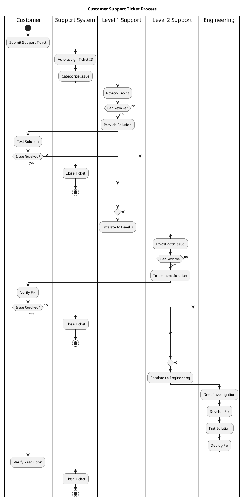

---

## Activity Diagram Patterns

### 1. Sequential Processing

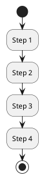

### 2. Conditional Processing

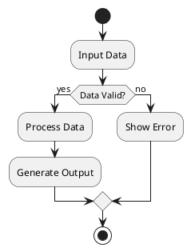

### 3. Parallel Processing

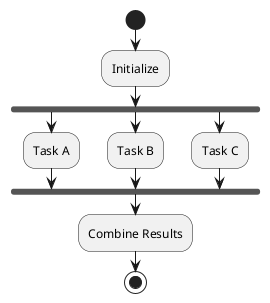

### 4. Loop Processing

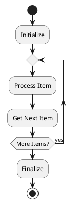

### 5. Exception Handling Pattern

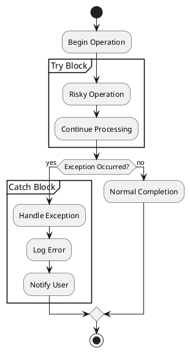

---

## Best Practices

### 1. Naming Conventions
- **Activities**: Use verb phrases (e.g., "Process Order", "Validate Input")
- **Decision Points**: Use questions (e.g., "Payment Valid?", "Items Available?")
- **Swimlanes**: Use role names or system names

### 2. Level of Detail
- **High-level**: Focus on major activities and decisions
- **Detailed**: Include all steps and conditions
- **Consistent**: Maintain same level throughout diagram

### 3. Layout and Organization
- **Top to bottom**: Generally flow from top to bottom
- **Left to right**: Use for parallel activities
- **Minimize crossings**: Avoid crossing flow lines
- **Group related**: Keep related activities close together

### 4. Swimlane Usage
- **Clear responsibility**: Each swimlane should have clear ownership
- **Minimize handoffs**: Reduce activities crossing swimlanes
- **Logical grouping**: Group by role, system, or department

### 5. Decision Points
- **Clear conditions**: Make decision criteria explicit
- **Complete coverage**: Ensure all possible paths are covered
- **Mutually exclusive**: Conditions should not overlap

---

## Common Mistakes to Avoid

### 1. Too Much Detail
❌ **Wrong**: Including every minor step
✅ **Correct**: Focus on significant activities

### 2. Missing Decision Outcomes
❌ **Wrong**: Decision points without clear yes/no paths
✅ **Correct**: All decision branches clearly labeled

### 3. Unbalanced Parallel Flows
❌ **Wrong**: Fork without corresponding join
✅ **Correct**: Every fork has a matching join

### 4. Unclear Swimlane Boundaries
❌ **Wrong**: Activities spanning multiple swimlanes
✅ **Correct**: Each activity clearly in one swimlane

### 5. Complex Nested Structures
❌ **Wrong**: Deeply nested loops and conditions
✅ **Correct**: Break complex flows into sub-diagrams

---

## Advanced Features

### 1. Object Flow

Show how objects move through the process.

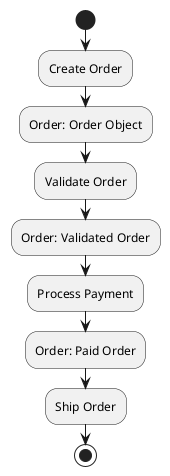

### 2. Signals and Events

Show external events that trigger activities.

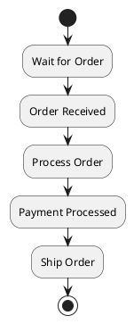

### 3. Time Events

Show time-based triggers.

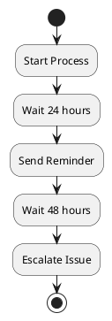

### 4. Interruption Regions

Show how processes can be interrupted.

```plantuml
@startuml
start
partition "Main Process" {
  :Step 1;
  :Step 2;
  :Step 3;
}
note right: Can be interrupted\nby emergency stop
:Complete Process;
stop
@enduml
```

---

## Integration with Other Diagrams

### 1. Use Case to Activity
- Use case scenarios → activity diagrams
- Use case steps → activities
- Alternative flows → decision points

### 2. Activity to Sequence
- Activities → messages between objects
- Swimlanes → lifelines
- Flow → message sequence

### 3. Activity to Class
- Activities → methods in classes
- Object flow → class relationships
- Swimlanes → class responsibilities

---

## Tools and Techniques

### 1. PlantUML Activity Diagrams
```plantuml
@startuml
start
:Activity;
if (condition?) then (yes)
  :Action A;
else (no)
  :Action B;
endif
stop
@enduml
```

### 2. Business Process Modeling
- **BPMN**: Business Process Model and Notation
- **Workflow engines**: Execute activity diagrams
- **Process mining**: Generate diagrams from logs

### 3. Algorithm Documentation
- **Pseudocode**: Convert to activity diagrams
- **Flowcharts**: Similar to activity diagrams
- **State machines**: For complex control logic

---

## Validation and Testing

### 1. Completeness Check
- All paths lead to end points
- No orphaned activities
- All decision branches covered

### 2. Consistency Check
- Activities match use case descriptions
- Swimlanes align with system architecture
- Object flow matches class diagrams

### 3. Performance Analysis
- Identify bottlenecks
- Parallel opportunities
- Critical path analysis

---

**Next Chapter**: Continue to [Chapter 8: State Diagrams](./08-state-diagrams.md) to learn about modeling object lifecycles and state transitions.

---

**Key Takeaways:**
- Activity diagrams model workflows and business processes
- Use activities, decisions, forks, and joins effectively
- Swimlanes organize activities by responsibility
- Focus on significant activities, not every detail
- Ensure all decision paths are covered
- Use parallel flows to show concurrent activities 