# Chapter 8: State Diagrams

State diagrams (also called State Machine diagrams) are behavioral diagrams that show how an object changes state in response to events. They model the lifecycle of objects and the dynamic behavior of systems by showing states, transitions, and the events that trigger them.

## What is a State Diagram?

A **State Diagram** shows:
- **States**: Conditions or situations during an object's lifetime
- **Transitions**: Changes from one state to another
- **Events**: Triggers that cause transitions
- **Guards**: Conditions that must be true for transitions
- **Actions**: Activities performed during transitions or in states

State diagrams are primarily used for:
- Object lifecycle modeling
- Protocol specification
- User interface behavior
- System state management
- Reactive system design

---

## Basic Elements

### 1. States

**Definition**: A condition or situation during the life of an object

**Notation**: Rounded rectangle with state name

**Types of States**:
- **Simple State**: Basic state with no internal structure
- **Composite State**: State containing other states
- **Initial State**: Black filled circle - starting point
- **Final State**: Black filled circle with border - ending point

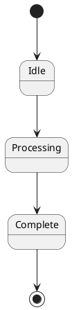

### 2. Transitions

**Definition**: Change from one state to another

**Notation**: Arrow between states

**Syntax**: `event [guard] / action`

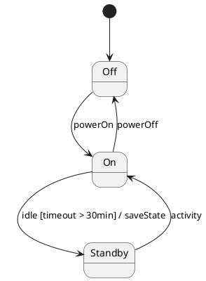

### 3. Events

**Definition**: Occurrences that trigger state transitions

**Types**:
- **Signal Events**: External signals
- **Call Events**: Method calls
- **Time Events**: Time-based triggers
- **Change Events**: Condition changes

### 4. Guards

**Definition**: Boolean conditions that must be true for transition

**Notation**: Square brackets `[condition]`

### 5. Actions

**Definition**: Activities performed during transitions

**Types**:
- **Entry Actions**: Performed when entering a state
- **Exit Actions**: Performed when leaving a state
- **Transition Actions**: Performed during transition

---

## State Types and Notation

### 1. Simple States

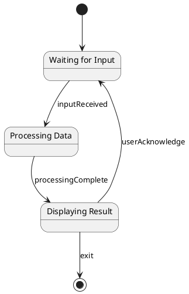

### 2. States with Internal Activities

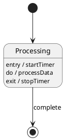

### 3. Composite States (Nested States)

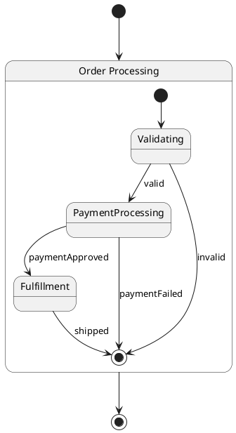

### 4. Concurrent States (Parallel Regions)

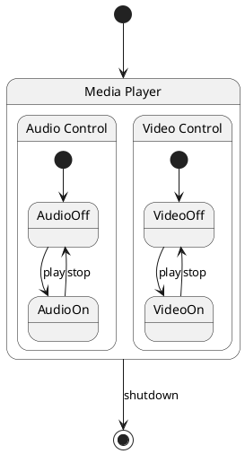

---

## Complete Example: Order State Machine

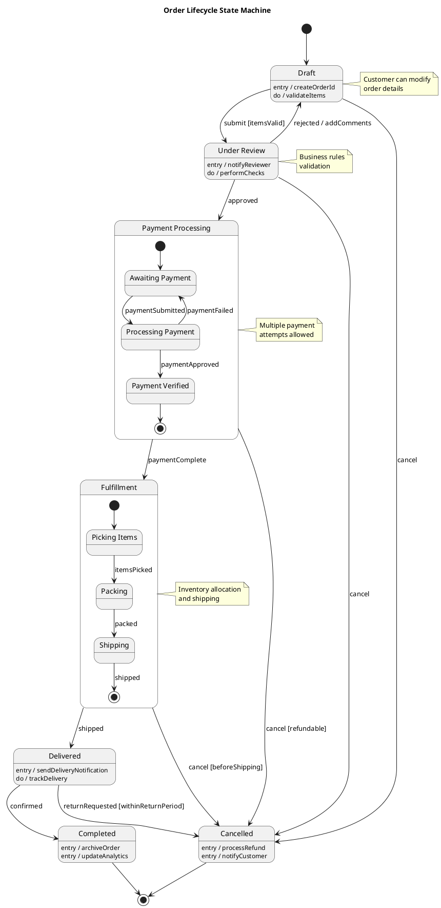

---

## Real-World Examples

### Example 1: User Session State Machine

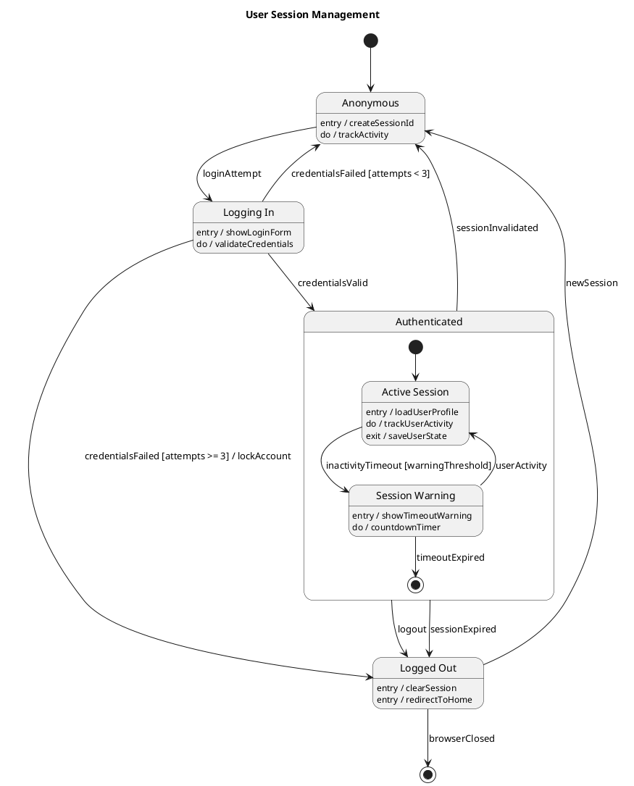

### Example 2: ATM Transaction State Machine

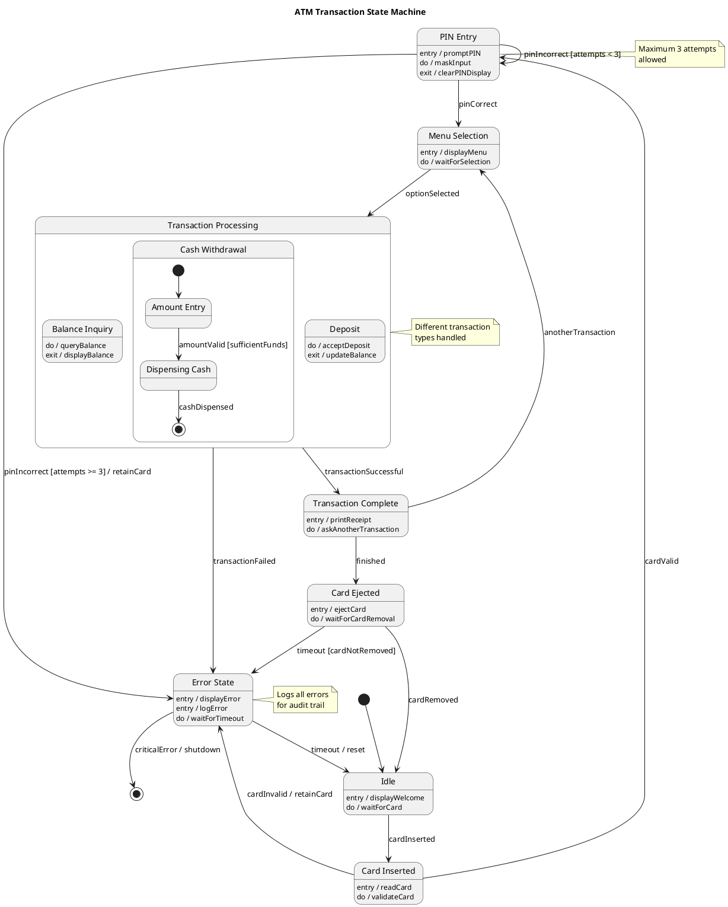

---

## Advanced State Machine Concepts

### 1. History States

Remember the last active substate when re-entering a composite state.

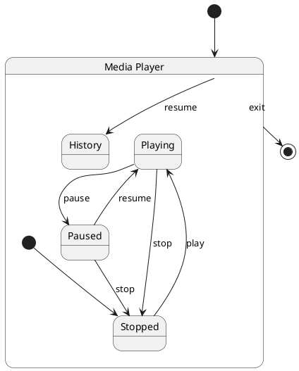

### 2. Junction and Choice Points

**Junction**: Static conditional branching
**Choice**: Dynamic conditional branching

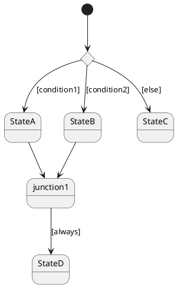

### 3. Entry and Exit Points

Define specific entry and exit points for composite states.

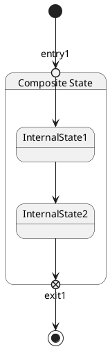

---

## State Machine Patterns

### 1. Simple State Machine

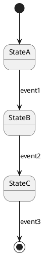

### 2. State Machine with Guards

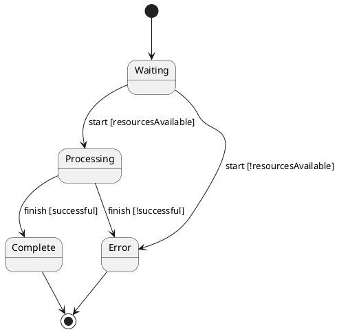

### 3. Hierarchical State Machine

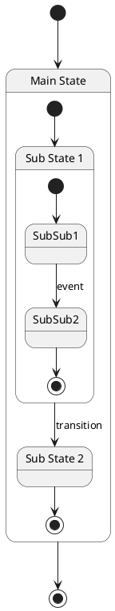

### 4. Concurrent State Machine

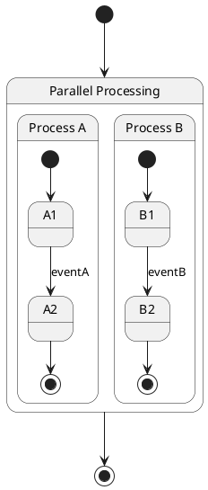

---

## Best Practices

### 1. State Naming
- Use noun phrases for states (e.g., "Waiting", "Processing", "Complete")
- Be descriptive and specific
- Avoid implementation details in names

### 2. Transition Labeling
- Use clear event names
- Include guards when necessary
- Specify actions when important
- Format: `event [guard] / action`

### 3. State Organization
- Group related states in composite states
- Use hierarchy to manage complexity
- Keep diagrams readable and focused

### 4. Event Handling
- Define all possible events for each state
- Handle error conditions explicitly
- Consider timeout events

### 5. Guard Conditions
- Make guards mutually exclusive when possible
- Use clear, testable conditions
- Document complex guard logic

---

## Common Mistakes to Avoid

### 1. Missing Transitions
❌ **Wrong**: States with no way to exit
✅ **Correct**: Every state should have exit transitions

### 2. Ambiguous Guards
❌ **Wrong**: Overlapping guard conditions
✅ **Correct**: Mutually exclusive guards

### 3. Too Many States
❌ **Wrong**: Overly complex state machines
✅ **Correct**: Use hierarchy to manage complexity

### 4. Implementation Details
❌ **Wrong**: States representing code structure
✅ **Correct**: States representing business concepts

### 5. Missing Error Handling
❌ **Wrong**: No error or exception states
✅ **Correct**: Explicit error handling paths

---

## Integration with Other Diagrams

### 1. Class Diagrams
- States → object states
- Transitions → method calls
- Events → method parameters

### 2. Sequence Diagrams
- State changes → message responses
- Events → incoming messages
- Actions → outgoing messages

### 3. Activity Diagrams
- States → activities
- Transitions → control flow
- Guards → decision conditions

---

## Tools and Implementation

### 1. PlantUML State Diagrams
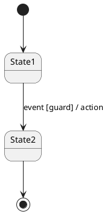

### 2. State Machine Implementation
- **State Pattern**: Object-oriented implementation
- **State Tables**: Tabular representation
- **State Charts**: Executable specifications

### 3. Validation and Testing
- **State Coverage**: Test all states
- **Transition Coverage**: Test all transitions
- **Guard Coverage**: Test all guard conditions

---

## Performance Considerations

### 1. State Machine Complexity
- Limit nesting depth
- Minimize concurrent regions
- Use appropriate abstraction levels

### 2. Event Processing
- Consider event queuing
- Handle event priorities
- Manage event timing

### 3. Memory Usage
- Optimize state representation
- Consider state compression
- Manage history states efficiently

---

**Next Chapter**: Continue to [Chapter 9: Component Diagrams](./09-component-diagrams.md) to learn about modeling system architecture and component relationships.

---

**Key Takeaways:**
- State diagrams model object lifecycles and system behavior
- Use states, transitions, events, guards, and actions effectively
- Organize complex behavior with composite and concurrent states
- Handle all possible events and error conditions
- Keep diagrams focused and at appropriate abstraction level
- Integrate state machines with other UML diagrams for complete system models 