# Chapter 9: Component Diagrams

Component diagrams are structural diagrams that show the organization and dependencies among software components. They model the high-level architecture of a system by showing how components are connected through their interfaces.

## What is a Component Diagram?

A **Component Diagram** shows:
- **Components**: Modular parts of a system
- **Interfaces**: Contracts that components provide or require
- **Dependencies**: How components depend on each other
- **Ports**: Interaction points on components
- **Connectors**: Links between components

Component diagrams are primarily used for:
- System architecture design
- Component-based development
- Deployment planning
- Understanding system structure
- Interface specification

---

## Basic Elements

### 1. Components

**Definition**: A modular, deployable, and replaceable part of a system

**Notation**: Rectangle with component stereotype or component icon

**Types**:
- **Subsystem**: Large-scale component
- **Module**: Mid-level component
- **Class**: Fine-grained component

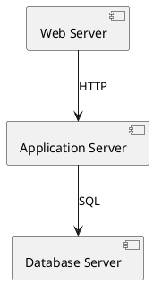

### 2. Interfaces

**Definition**: Contracts that specify what services a component provides or requires

**Types**:
- **Provided Interface**: Services the component offers (lollipop notation)
- **Required Interface**: Services the component needs (socket notation)

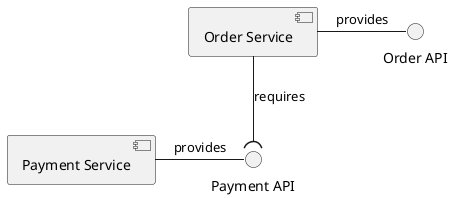

### 3. Ports

**Definition**: Interaction points that specify how a component interacts with its environment

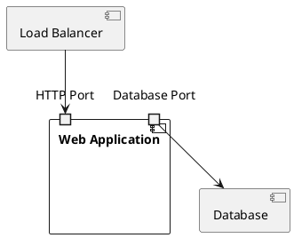

### 4. Dependencies

**Definition**: Relationships showing that one component depends on another

**Notation**: Dashed arrow with `<<use>>` or dependency stereotype

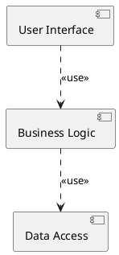

---

## Component Types and Patterns

### 1. Layered Architecture

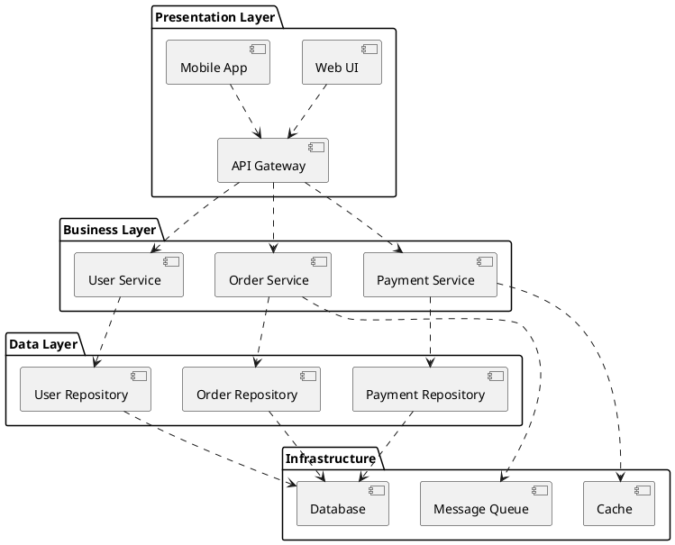

### 2. Microservices Architecture

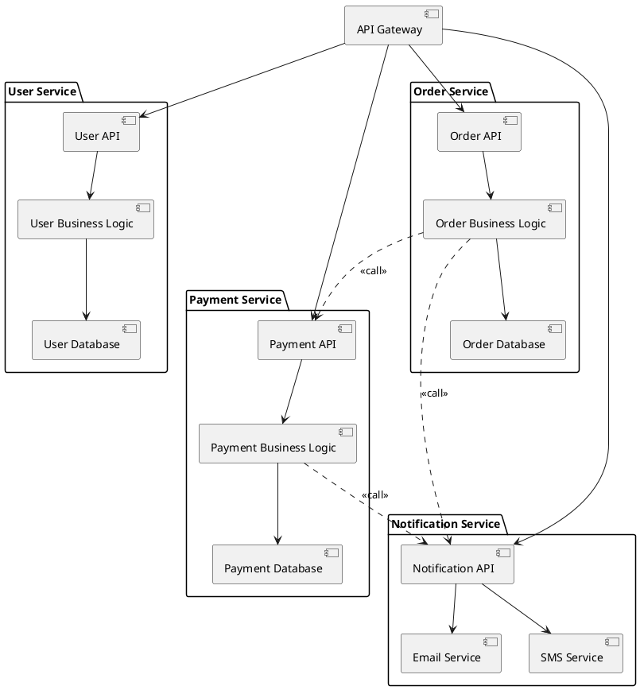

---

## Complete Example: E-commerce System Architecture

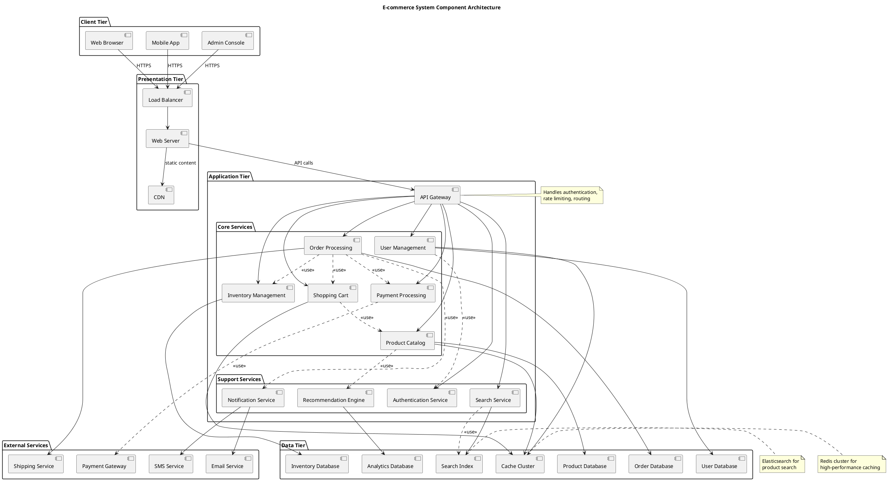

---

## Interface Modeling

### 1. Provided and Required Interfaces

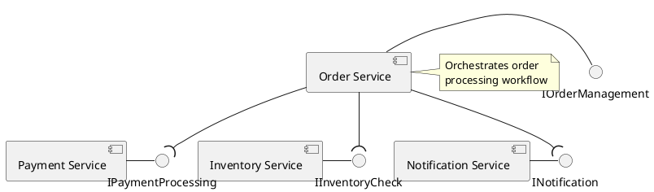

### 2. Interface Specifications

```plantuml
@startuml
interface "IPaymentProcessor" as IPayment {
  + processPayment(amount: Money, method: PaymentMethod): PaymentResult
  + refundPayment(transactionId: String): RefundResult
  + validatePaymentMethod(method: PaymentMethod): boolean
}

interface "IInventoryManager" as IInventory {
  + checkAvailability(productId: String, quantity: int): boolean
  + reserveItems(productId: String, quantity: int): ReservationId
  + releaseReservation(reservationId: ReservationId): void
  + updateStock(productId: String, quantity: int): void
}

component "Payment Service" as PaySvc
component "Inventory Service" as InvSvc

PaySvc ..|> IPayment : implements
InvSvc ..|> IInventory : implements
@enduml
```

---

## Deployment and Packaging

### 1. Component Packaging

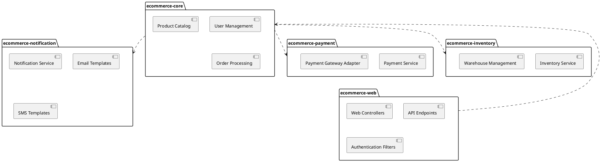

### 2. Deployment Components

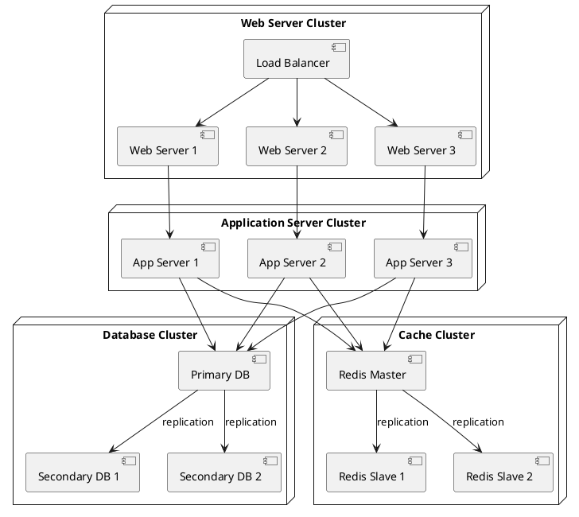

---

## Component Patterns

### 1. Model-View-Controller (MVC)

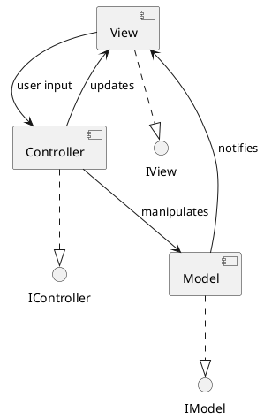

### 2. Repository Pattern

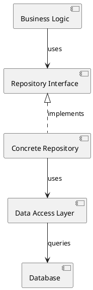

### 3. Service-Oriented Architecture (SOA)

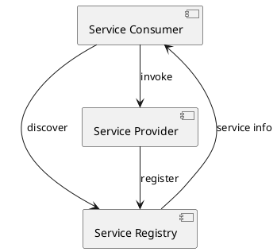

---

## Best Practices

### 1. Component Design Principles
- **Single Responsibility**: Each component has one clear purpose
- **High Cohesion**: Related functionality grouped together
- **Loose Coupling**: Minimal dependencies between components
- **Interface Segregation**: Small, focused interfaces

### 2. Dependency Management
- **Dependency Inversion**: Depend on abstractions, not concretions
- **Minimize Dependencies**: Reduce coupling between components
- **Explicit Dependencies**: Make dependencies clear and visible
- **Avoid Circular Dependencies**: Prevent circular references

### 3. Interface Design
- **Stable Interfaces**: Minimize interface changes
- **Versioning**: Support multiple interface versions
- **Documentation**: Clearly document interface contracts
- **Error Handling**: Define error handling strategies

### 4. Component Organization
- **Logical Grouping**: Group related components
- **Layer Separation**: Separate concerns into layers
- **Package Structure**: Organize components into packages
- **Naming Conventions**: Use consistent naming

---

## Common Mistakes to Avoid

### 1. Overly Complex Components
❌ **Wrong**: Components that do too many things
✅ **Correct**: Focused, single-purpose components

### 2. Tight Coupling
❌ **Wrong**: Direct dependencies between components
✅ **Correct**: Interface-based dependencies

### 3. Missing Interfaces
❌ **Wrong**: Components communicating directly
✅ **Correct**: Well-defined interfaces between components

### 4. Inconsistent Abstraction Levels
❌ **Wrong**: Mixing high-level and low-level components
✅ **Correct**: Consistent abstraction levels

### 5. Poor Package Organization
❌ **Wrong**: Random component grouping
✅ **Correct**: Logical package structure

---

## Integration with Other Diagrams

### 1. Class Diagrams
- Components → packages or subsystems
- Interfaces → interface classes
- Dependencies → package dependencies

### 2. Deployment Diagrams
- Components → deployed artifacts
- Nodes → deployment targets
- Connections → network links

### 3. Sequence Diagrams
- Components → lifelines
- Interface calls → messages
- Component interactions → message flows

---

## Tools and Technologies

### 1. Component Frameworks
- **Spring Framework**: Dependency injection
- **OSGi**: Dynamic component model
- **Enterprise JavaBeans**: Component architecture
- **COM/DCOM**: Microsoft component model

### 2. Modeling Tools
- **Enterprise Architect**: Component modeling
- **Visual Paradigm**: UML component diagrams
- **Lucidchart**: Online component diagrams
- **PlantUML**: Text-based component diagrams

### 3. Architecture Documentation
- **C4 Model**: Context, containers, components, code
- **Arc42**: Architecture documentation template
- **Architecture Decision Records**: Document decisions

---

## Performance and Scalability

### 1. Component Granularity
- **Coarse-grained**: Fewer, larger components
- **Fine-grained**: Many, smaller components
- **Balance**: Right size for your needs

### 2. Communication Patterns
- **Synchronous**: Direct method calls
- **Asynchronous**: Message-based communication
- **Event-driven**: Publish-subscribe patterns

### 3. Scalability Considerations
- **Stateless Components**: Enable horizontal scaling
- **Load Distribution**: Balance load across instances
- **Caching**: Reduce component interactions
- **Connection Pooling**: Optimize resource usage

---

**Next Chapter**: Continue to [Chapter 10: Deployment Diagrams](./10-deployment-diagrams.md) to learn about modeling system deployment and infrastructure.

---

**Key Takeaways:**
- Component diagrams model system architecture and component relationships
- Use interfaces to define contracts between components
- Apply design principles: single responsibility, loose coupling, high cohesion
- Organize components into logical packages and layers
- Consider deployment and scalability requirements
- Integrate component diagrams with other UML diagrams for complete system documentation 