# Chapter 10: Deployment Diagrams

Deployment diagrams are structural diagrams that show the physical deployment of software components on hardware nodes. They model the runtime architecture of a system by showing how software artifacts are distributed across the computing infrastructure.

## What is a Deployment Diagram?

A **Deployment Diagram** shows:
- **Nodes**: Physical or virtual computing resources
- **Artifacts**: Deployable software components
- **Deployment**: How artifacts are deployed on nodes
- **Communication**: Network connections between nodes
- **Dependencies**: Relationships between deployed components

Deployment diagrams are primarily used for:
- System deployment planning
- Infrastructure documentation
- Performance analysis
- Security planning
- Capacity planning

---

## Basic Elements

### 1. Nodes

**Definition**: Physical or virtual computing resources that can host software components

**Types**:
- **Device Nodes**: Physical hardware (servers, workstations, mobile devices)
- **Execution Environment Nodes**: Software platforms (JVM, .NET runtime, containers)

**Notation**: 3D box with node name

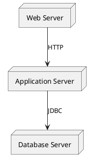

### 2. Artifacts

**Definition**: Physical pieces of software that are deployed on nodes

**Types**:
- **Executable Files**: Applications, services
- **Libraries**: JAR files, DLLs
- **Configuration Files**: Properties, XML files
- **Data Files**: Databases, documents

**Notation**: Rectangle with artifact stereotype

```plantuml
@startuml
artifact "webapp.war" as WebApp
artifact "app.jar" as AppJar
artifact "config.xml" as Config

node "Tomcat Server" as Tomcat {
  WebApp
  Config
}

node "JVM" as JVM {
  AppJar
}
@enduml
```

### 3. Communication Paths

**Definition**: Network connections between nodes

**Notation**: Lines connecting nodes with protocol labels

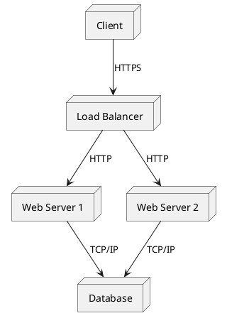

---

## Node Types and Environments

### 1. Physical Nodes

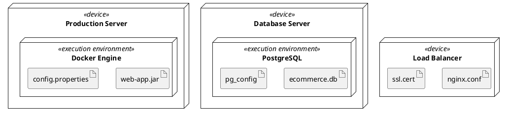

### 2. Cloud Infrastructure

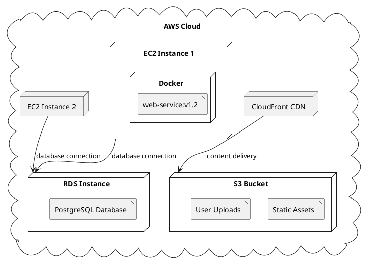

### 3. Containerized Deployment

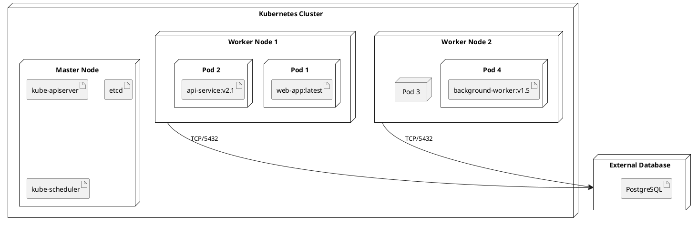

---

## Complete Example: E-commerce Deployment Architecture

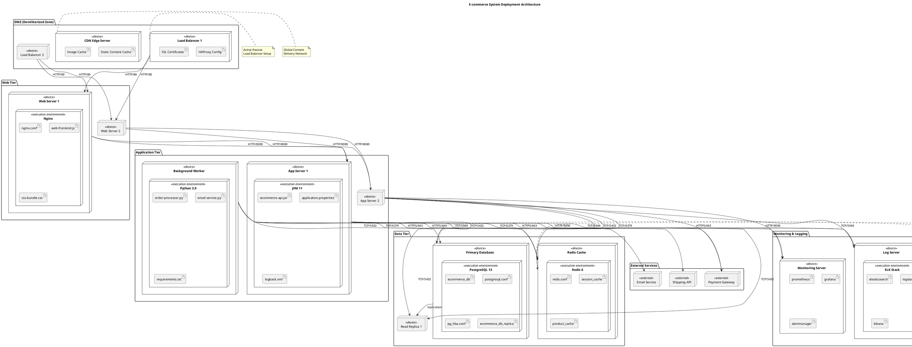

---

## Deployment Patterns

### 1. Three-Tier Architecture

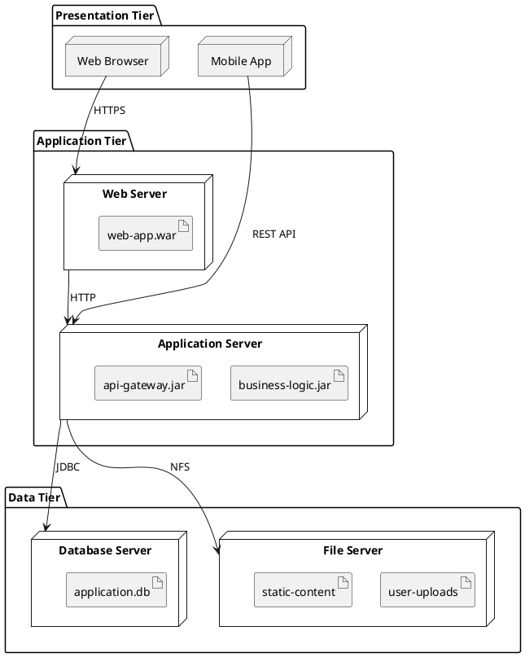

### 2. Microservices Deployment

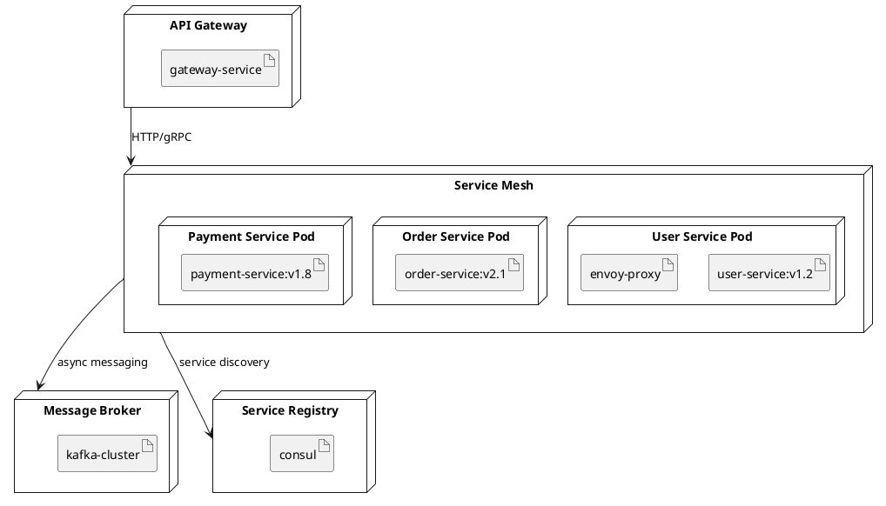

### 3. Serverless Architecture

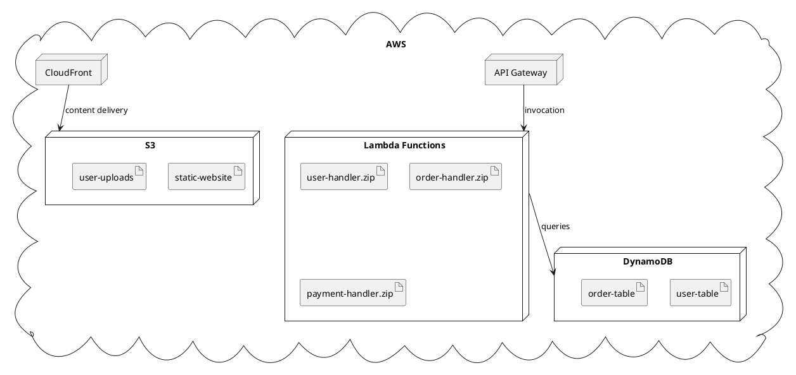

---

## Infrastructure Considerations

### 1. High Availability Setup

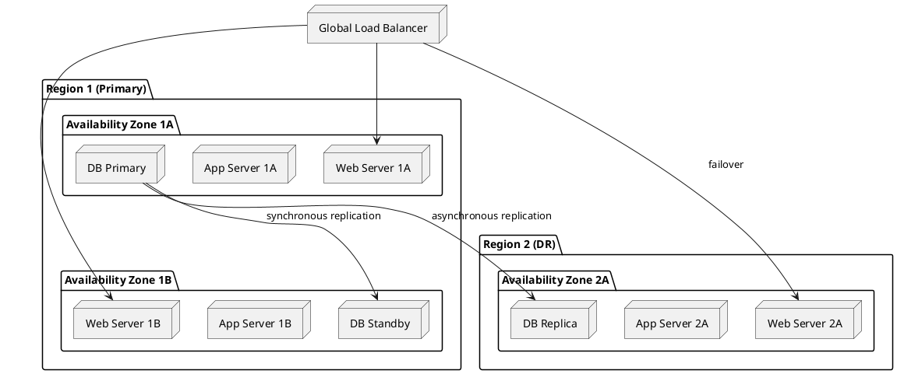

### 2. Auto-Scaling Configuration

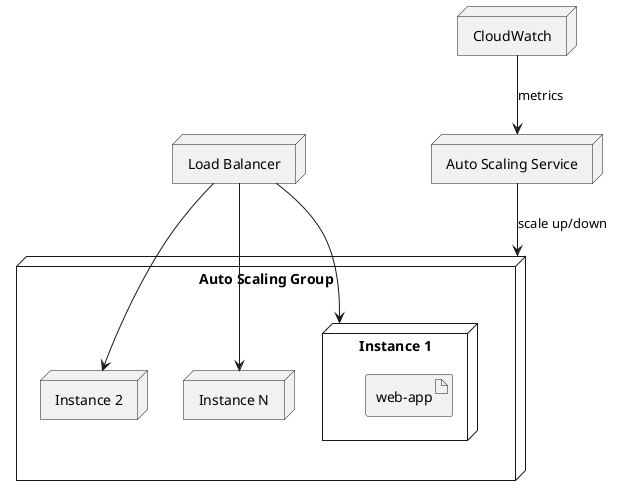

### 3. Security Zones

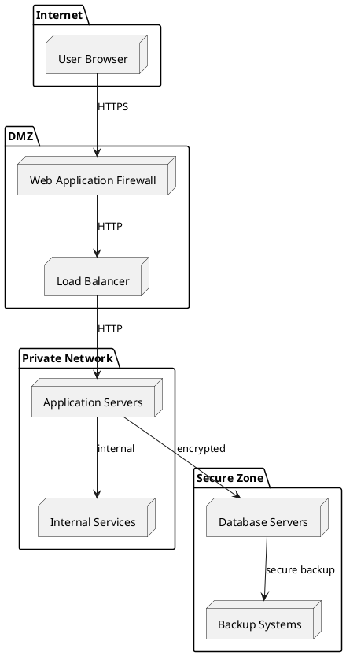

---

## Performance and Scalability

### 1. Caching Strategy

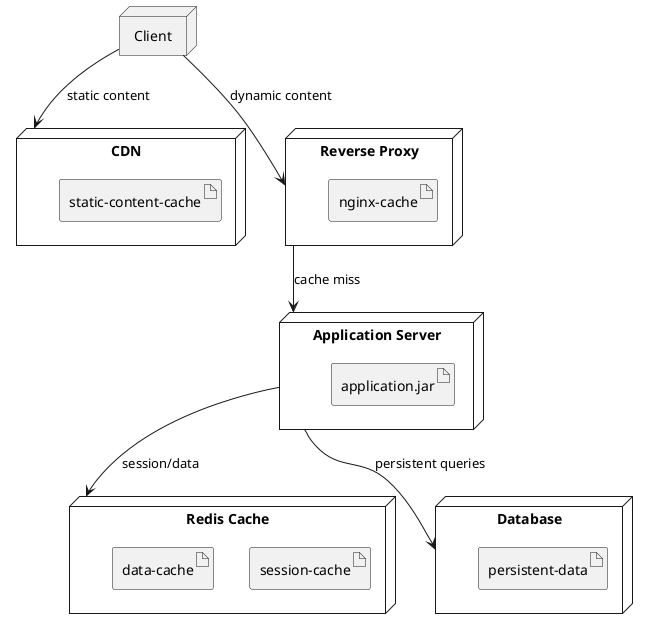

### 2. Database Scaling

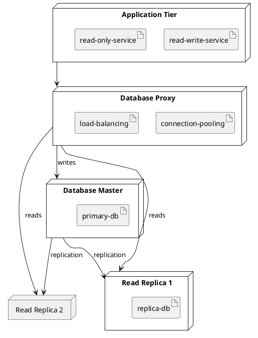

---

## Best Practices

### 1. Deployment Principles
- **Immutable Infrastructure**: Deploy new versions rather than updating
- **Blue-Green Deployment**: Maintain two identical environments
- **Rolling Updates**: Gradual replacement of instances
- **Canary Releases**: Test with small subset of users

### 2. Security Considerations
- **Network Segmentation**: Isolate different tiers
- **Encryption**: Encrypt data in transit and at rest
- **Access Control**: Implement proper authentication and authorization
- **Monitoring**: Log and monitor all access

### 3. Monitoring and Observability
- **Health Checks**: Monitor application and infrastructure health
- **Metrics Collection**: Gather performance and business metrics
- **Distributed Tracing**: Track requests across services
- **Alerting**: Set up proactive alerts for issues

### 4. Disaster Recovery
- **Backup Strategy**: Regular, tested backups
- **Geographic Distribution**: Deploy across multiple regions
- **Recovery Procedures**: Documented and tested recovery plans
- **RTO/RPO Targets**: Define recovery time and point objectives

---

## Common Deployment Challenges

### 1. Configuration Management
❌ **Problem**: Inconsistent configurations across environments
✅ **Solution**: Infrastructure as Code (IaC) and configuration management tools

### 2. Dependency Management
❌ **Problem**: Version conflicts and missing dependencies
✅ **Solution**: Containerization and dependency isolation

### 3. Service Discovery
❌ **Problem**: Hard-coded service endpoints
✅ **Solution**: Service registry and discovery mechanisms

### 4. Data Consistency
❌ **Problem**: Data synchronization across distributed systems
✅ **Solution**: Event-driven architecture and eventual consistency patterns

---

## Tools and Technologies

### 1. Infrastructure as Code
- **Terraform**: Multi-cloud infrastructure provisioning
- **CloudFormation**: AWS infrastructure templates
- **Ansible**: Configuration management and deployment
- **Kubernetes**: Container orchestration

### 2. Containerization
- **Docker**: Container runtime and images
- **Kubernetes**: Container orchestration platform
- **Docker Swarm**: Docker-native clustering
- **OpenShift**: Enterprise Kubernetes platform

### 3. Cloud Platforms
- **AWS**: Amazon Web Services
- **Azure**: Microsoft Azure
- **GCP**: Google Cloud Platform
- **Digital Ocean**: Simple cloud infrastructure

### 4. Monitoring Tools
- **Prometheus**: Metrics collection and alerting
- **Grafana**: Metrics visualization
- **ELK Stack**: Logging and log analysis
- **Jaeger**: Distributed tracing

---

## Integration with Development Process

### 1. CI/CD Pipeline Integration
- Deployment diagrams guide pipeline design
- Infrastructure changes tracked in version control
- Automated testing of deployment configurations
- Progressive deployment strategies

### 2. Environment Management
- Consistent environments across development lifecycle
- Environment-specific configurations
- Promotion process between environments
- Environment provisioning automation

### 3. Capacity Planning
- Performance requirements drive infrastructure design
- Load testing validates deployment architecture
- Scaling strategies based on usage patterns
- Cost optimization through right-sizing

---

**Conclusion**: Deployment diagrams are essential for documenting and planning system infrastructure. They help teams understand how software components are distributed across hardware resources and guide decisions about scalability, security, and performance.

---

**Key Takeaways:**
- Deployment diagrams model the physical architecture of systems
- Use nodes to represent computing resources and artifacts for software components
- Consider high availability, scalability, and security in deployment design
- Integrate deployment planning with development and operations processes
- Use modern tools and practices like IaC, containers, and cloud platforms
- Document and test disaster recovery procedures 