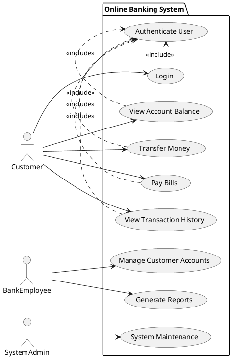
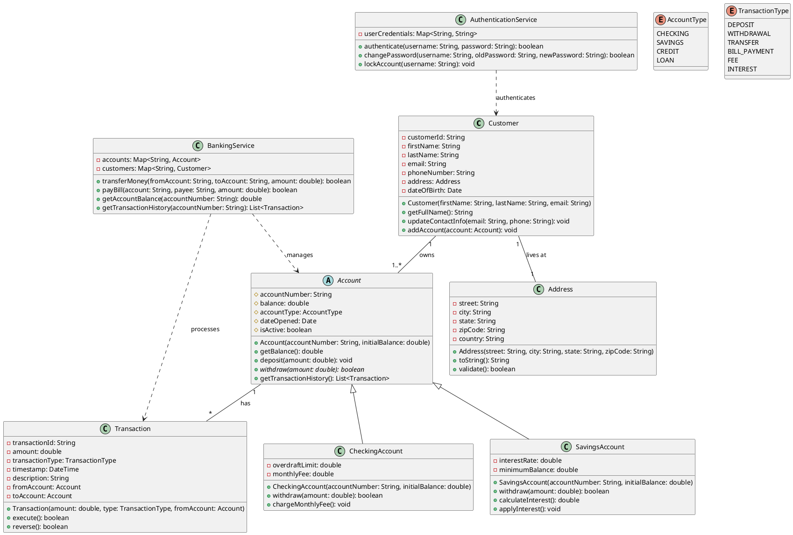
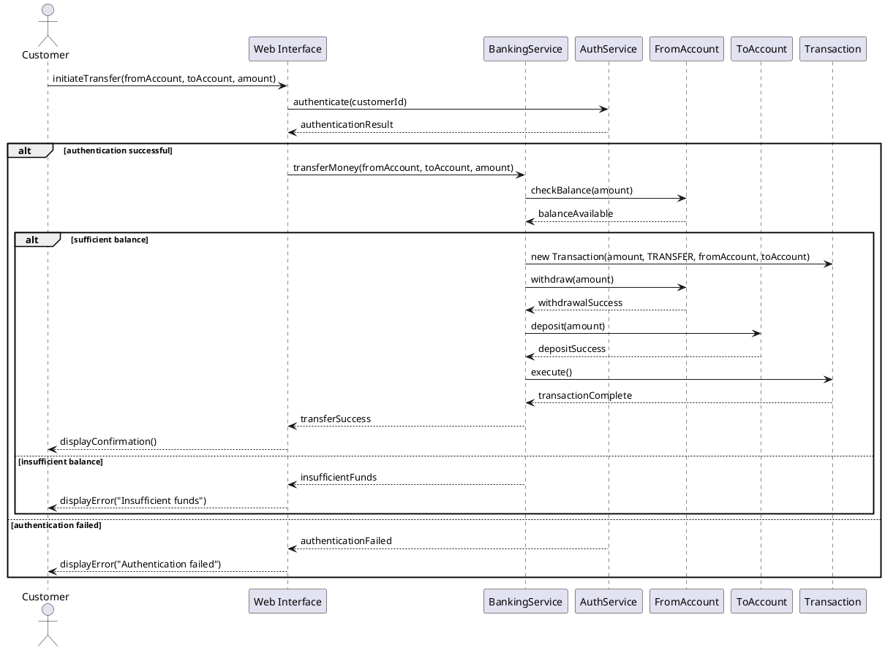
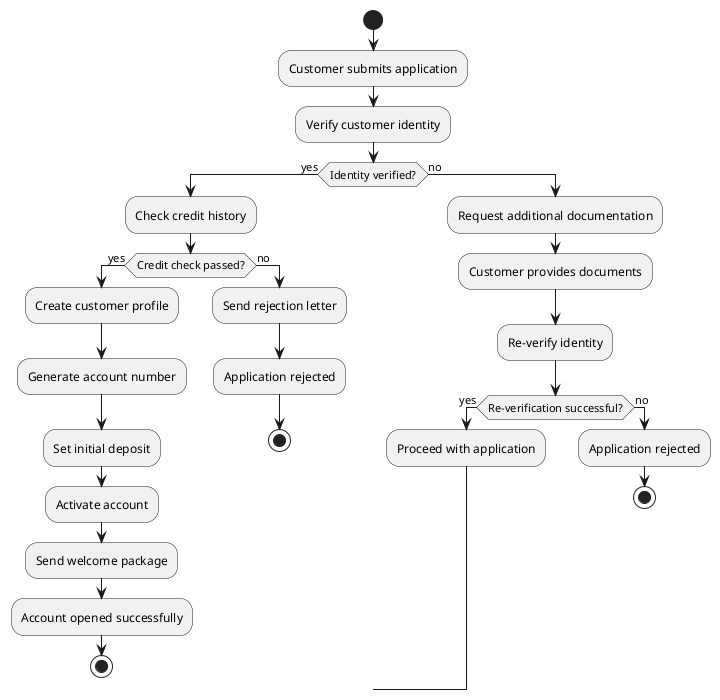
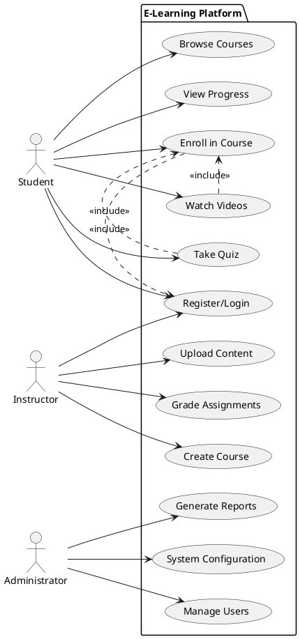
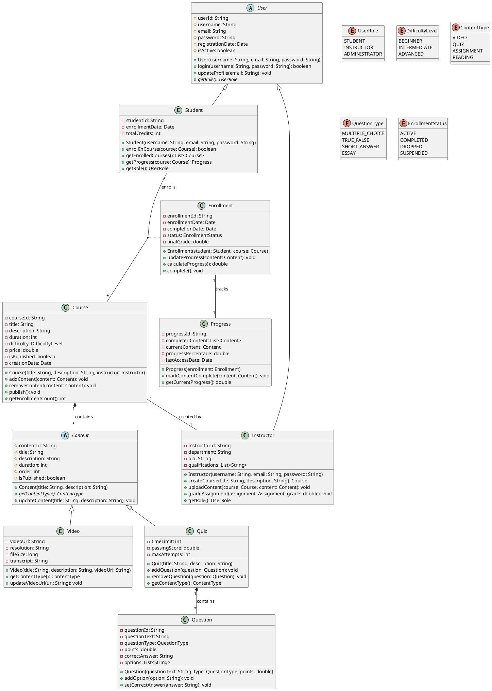
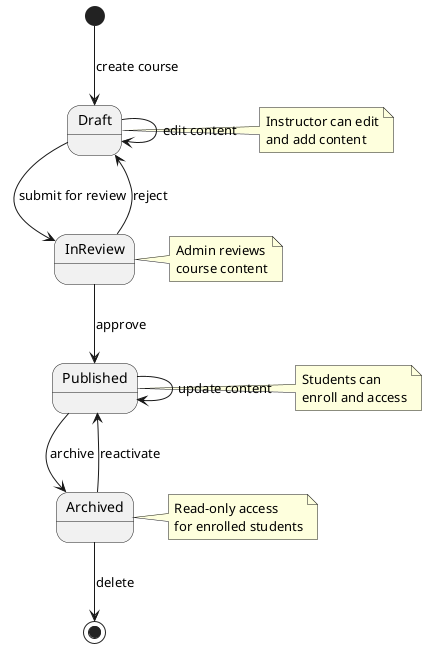
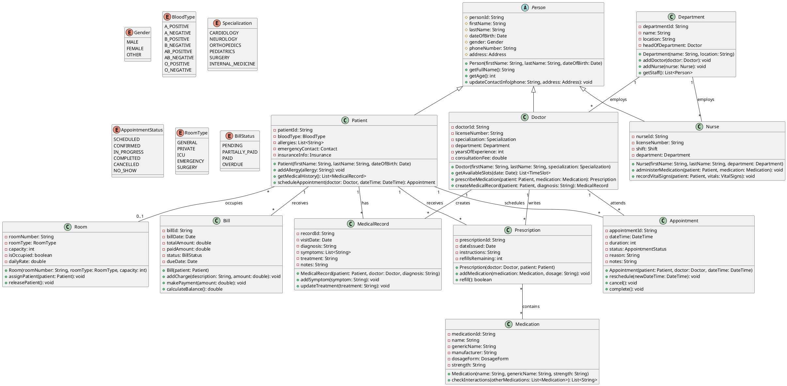
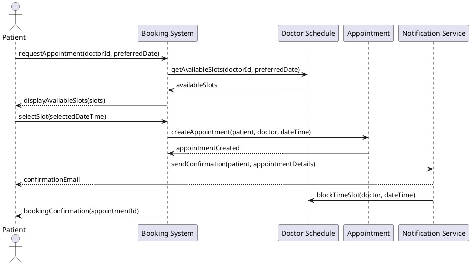
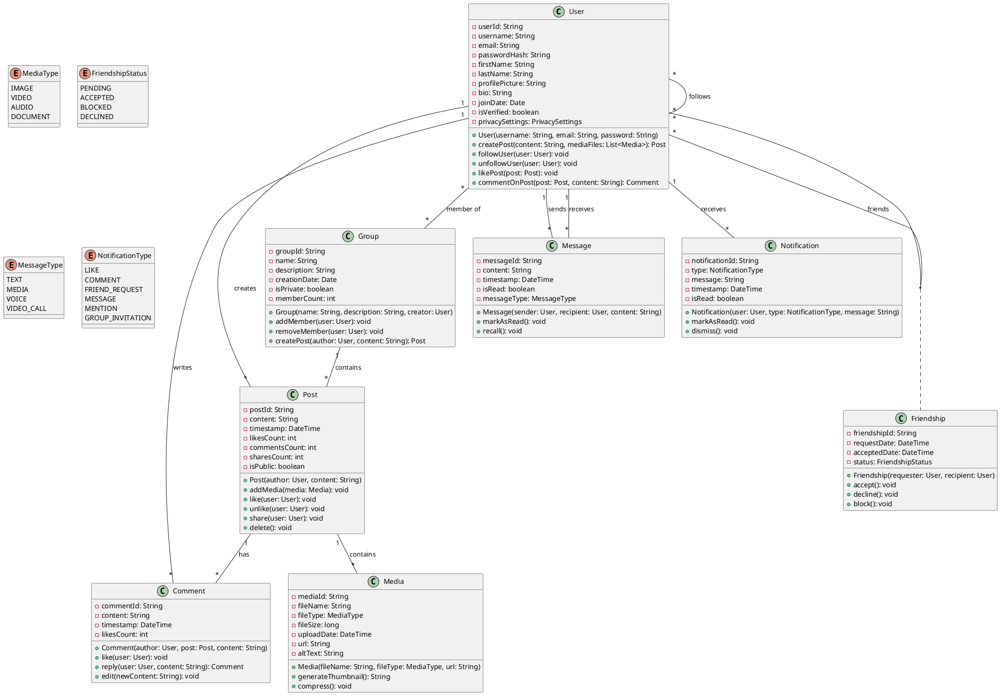

# Chapter 11: Examples and Case Studies

This chapter provides comprehensive real-world examples that demonstrate how to apply UML concepts in practice. Each example includes multiple diagram types to show different perspectives of the same system.

---

## Case Study 1: Online Banking System

### System Overview
An online banking system that allows customers to manage their accounts, transfer money, pay bills, and view transaction history.

### 1.1 Use Case Diagram



### 1.2 Class Diagram



### 1.3 Sequence Diagram: Money Transfer



### 1.4 Activity Diagram: Account Opening Process



---

## Case Study 2: E-Learning Platform

### System Overview
An online learning platform where students can enroll in courses, watch videos, take quizzes, and track their progress.

### 2.1 Use Case Diagram



### 2.2 Class Diagram



### 2.3 State Diagram: Course Lifecycle



---

## Case Study 3: Hospital Management System

### System Overview
A comprehensive hospital management system for managing patients, doctors, appointments, medical records, and billing.

### 3.1 Class Diagram



### 3.2 Sequence Diagram: Patient Appointment Booking



---

## Case Study 4: Social Media Platform

### 4.1 Class Diagram



---

## Best Practices Demonstrated

### 1. Consistent Naming Conventions
- Classes use PascalCase: `BankingService`, `MedicalRecord`
- Attributes use camelCase: `firstName`, `accountNumber`
- Methods use camelCase: `calculateBalance()`, `updateProfile()`

### 2. Appropriate Relationships
- **Composition**: `Course *-- Content` (content belongs to course)
- **Aggregation**: `Department o-- Doctor` (doctors can change departments)
- **Inheritance**: `User <|-- Student` (student is a type of user)
- **Association**: `Patient -- Appointment` (patients have appointments)

### 3. Proper Use of Enums
- Defined clear enumeration types for status fields
- Used descriptive names for enum values
- Grouped related constants together

### 4. Abstraction and Interfaces
- Used abstract classes for common behavior: `Person`, `Account`, `Content`
- Defined clear inheritance hierarchies
- Separated interface from implementation

### 5. Multiplicity Specification
- Always specified relationship multiplicities
- Used appropriate cardinalities: `1`, `*`, `0..1`, `1..*`
- Considered real-world constraints

---

## Common Patterns in Examples

### 1. User Management Pattern
```
User (abstract) -> Student, Instructor, Doctor, Patient
```

### 2. Content Management Pattern
```
Content (abstract) -> Video, Quiz, Document
```

### 3. Transaction Pattern
```
Transaction -> Account (from/to)
```

### 4. Audit Trail Pattern
```
Entity -> History/Log records
```

### 5. Status Management Pattern
```
Entity -> Status (enum)
```

---

## Key Takeaways

1. **Start with Use Cases**: Always begin by understanding what the system should do
2. **Model Real Relationships**: Ensure relationships reflect real-world constraints
3. **Use Appropriate Abstractions**: Abstract common behavior into base classes
4. **Consider Lifecycle**: Model how objects change state over time
5. **Keep It Focused**: Each diagram should have a clear purpose
6. **Validate with Stakeholders**: Ensure diagrams accurately represent requirements
7. **Iterate and Refine**: UML diagrams evolve as understanding improves

---

**Conclusion**: These examples demonstrate how UML can be used to model complex real-world systems. The key is to choose the right diagrams for your audience and purpose, maintain consistency, and focus on clarity over completeness.

---

**Practice**: Try creating your own UML diagrams for systems you're familiar with, such as:
- Library management system
- Restaurant ordering system
- Hotel reservation system
- Inventory management system
- Student information system 