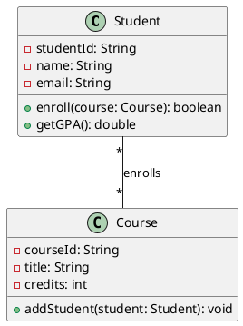
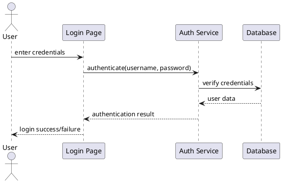
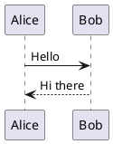
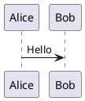

# PlantUML Setup Guide

This guide will help you set up PlantUML to generate images from the UML diagrams in this tutorial.

## What is PlantUML?

PlantUML is an open-source tool that allows you to create UML diagrams from plain text descriptions. It's perfect for version control and can be integrated into documentation workflows.

## Installation Options

### Option 1: Online PlantUML Editor (Easiest)

1. Visit [PlantUML Online Server](http://www.plantuml.com/plantuml/uml/)
2. Copy and paste any PlantUML code from this tutorial
3. Click "Submit" to generate the diagram
4. Download the image in your preferred format (PNG, SVG, etc.)

### Option 2: Local Installation

#### Prerequisites
- Java 8 or higher
- Graphviz (for complex diagrams)

#### Steps

1. **Install Java** (if not already installed):
   ```bash
   # Ubuntu/Debian
   sudo apt update
   sudo apt install openjdk-11-jdk
   
   # macOS (using Homebrew)
   brew install openjdk@11
   
   # Windows: Download from Oracle or use Chocolatey
   choco install openjdk11
   ```

2. **Install Graphviz**:
   ```bash
   # Ubuntu/Debian
   sudo apt install graphviz
   
   # macOS
   brew install graphviz
   
   # Windows
   choco install graphviz
   ```

3. **Download PlantUML JAR**:
   ```bash
   wget http://sourceforge.net/projects/plantuml/files/plantuml.jar/download -O plantuml.jar
   ```

4. **Create a diagram**:
   ```bash
   java -jar plantuml.jar diagram.puml
   ```

### Option 3: VS Code Extension

1. Install the "PlantUML" extension by jebbs
2. Install Java and Graphviz (as above)
3. Create a `.puml` file with your diagram code
4. Use `Ctrl+Shift+P` → "PlantUML: Preview Current Diagram"

### Option 4: Docker

```bash
# Run PlantUML server in Docker
docker run -d -p 8080:8080 plantuml/plantuml-server:jetty

# Access at http://localhost:8080
```

## Generating Images from Tutorial Examples

### Example 1: Simple Class Diagram

Create a file called `student.puml`:



Generate the image:
```bash
java -jar plantuml.jar student.puml
```

This creates `student.png` in the same directory.

### Example 2: Sequence Diagram

Create `login-sequence.puml`:



### Example 3: Use Case Diagram

Create `banking-usecase.puml`:


## Batch Processing

To generate images for all PlantUML files in a directory:

```bash
# Generate all .puml files
java -jar plantuml.jar *.puml

# Generate with specific format
java -jar plantuml.jar -tsvg *.puml

# Generate to specific directory
java -jar plantuml.jar -o ./images *.puml
```

## Output Formats

PlantUML supports various output formats:

- `-tpng` : PNG (default)
- `-tsvg` : SVG (vector graphics)
- `-teps` : EPS
- `-tpdf` : PDF
- `-tvdx` : VDX
- `-txmi` : XMI
- `-thtml` : HTML
- `-ttxt` : ASCII art

Example:
```bash
java -jar plantuml.jar -tsvg diagram.puml
```

## Integration with Documentation

### Markdown Integration

Many markdown processors support PlantUML integration:

```markdown

```

### GitHub Integration

GitHub doesn't natively support PlantUML, but you can:

1. Generate images locally
2. Commit them to your repository
3. Reference them in markdown:

```markdown

```

### GitLab Integration

GitLab supports PlantUML natively:

```markdown

```

## Automation Scripts

### Bash Script for Batch Generation

Create `generate-diagrams.sh`:

```bash
#!/bin/bash

# Create images directory if it doesn't exist
mkdir -p images

# Generate all PlantUML diagrams
for file in *.puml; do
    if [ -f "$file" ]; then
        echo "Generating $file..."
        java -jar plantuml.jar -o ./images "$file"
    fi
done

echo "All diagrams generated in ./images directory"
```

Make it executable:
```bash
chmod +x generate-diagrams.sh
./generate-diagrams.sh
```

### Python Script for Advanced Processing

Create `generate_uml.py`:

```python
import os
import subprocess
import glob

def generate_plantuml_diagrams():
    """Generate PNG images from all .puml files"""
    
    # Create images directory
    os.makedirs('images', exist_ok=True)
    
    # Find all .puml files
    puml_files = glob.glob('*.puml')
    
    if not puml_files:
        print("No .puml files found")
        return
    
    for puml_file in puml_files:
        print(f"Processing {puml_file}...")
        
        try:
            # Generate diagram
            subprocess.run([
                'java', '-jar', 'plantuml.jar',
                '-o', './images',
                puml_file
            ], check=True)
            
            print(f"✓ Generated image for {puml_file}")
            
        except subprocess.CalledProcessError as e:
            print(f"✗ Error processing {puml_file}: {e}")
        except FileNotFoundError:
            print("Error: PlantUML jar not found. Please download plantuml.jar")
            break

if __name__ == "__main__":
    generate_plantuml_diagrams()
```

Run it:
```bash
python generate_uml.py
```

## Troubleshooting

### Common Issues

1. **Java not found**:
   - Ensure Java is installed and in PATH
   - Check with `java -version`

2. **Graphviz not found**:
   - Install Graphviz
   - Add to PATH if necessary
   - Set GRAPHVIZ_DOT environment variable if needed

3. **Memory issues with large diagrams**:
   ```bash
   java -Xmx1024m -jar plantuml.jar diagram.puml
   ```

4. **Font issues**:
   - Install additional fonts if needed
   - Use `-charset UTF-8` flag for Unicode support

### Performance Tips

1. **Use SVG for large diagrams** - better scalability
2. **Split complex diagrams** into smaller ones
3. **Use includes** for common elements:
   ```plantuml
   @startuml
   !include common-styles.puml
   ' Your diagram here
   @enduml
   ```

## Advanced Features

### Themes and Styling

```plantuml
@startuml
!theme aws-orange
' Your diagram here
@enduml
```

### Custom Colors

```plantuml
@startuml
skinparam class {
    BackgroundColor LightBlue
    BorderColor DarkBlue
    ArrowColor Red
}
' Your diagram here
@enduml
```

### Preprocessing

```plantuml
@startuml
!define ENTITY(name) class name << (E,#FFAAAA) >>
!define SERVICE(name) class name << (S,#AAFFAA) >>

ENTITY(User)
SERVICE(UserService)
@enduml
```



## Next Steps

1. Try generating images from the examples in this tutorial
2. Experiment with different output formats
3. Set up automation for your documentation workflow
4. Explore advanced PlantUML features like themes and preprocessing

## Resources

- [PlantUML Official Website](https://plantuml.com/)
- [PlantUML Language Reference](https://plantuml.com/guide)
- [PlantUML Themes](https://the-lum.github.io/puml-themes-gallery/)
- [Real World PlantUML](https://real-world-plantuml.com/)

---

**Note**: All PlantUML code examples in this tutorial can be copied directly into any of these tools to generate visual diagrams. 